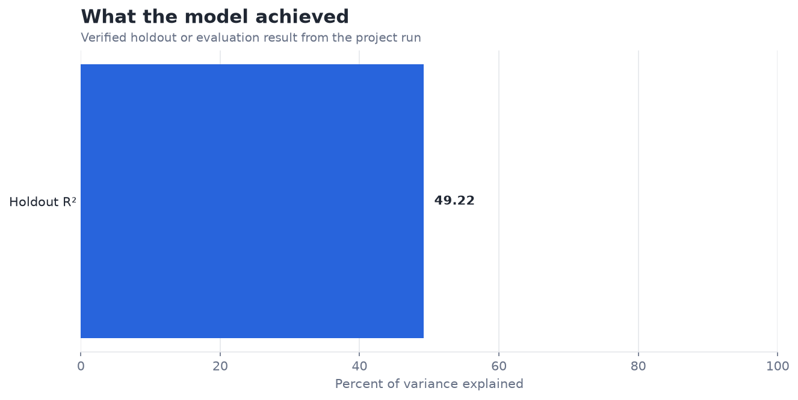
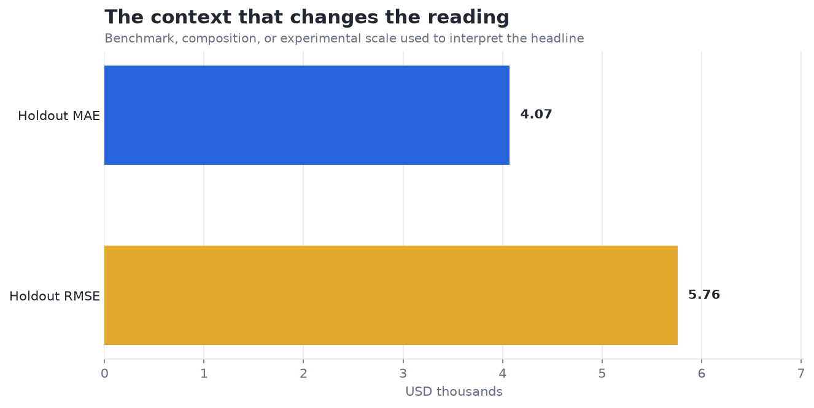

# Predict House Prices (Boston Housing Dataset) — Analysis Report

**Author:** Edward Ocran  
**Project:** 1  
**Validation status:** Reproduced locally from the project dataset and code

## Executive Summary

- Average room count explains 49.22% of holdout price variation, with a $4.07k mean absolute error.
- The slope remains economically meaningful: an additional room is associated with about $9.1k in median value. The R² result also makes the boundary clear—roughly half of holdout variation sits outside this single-feature model.
- **Recommended action:** Use this as an interpretable benchmark, not as a valuation engine.

## Analytical Question

How much signal does average room count carry for Boston-area home values?

## Data and Evaluation Design

The Kaggle Boston Housing file contributes 506 usable records. Following the course exercise, average rooms (`RM`) is the explanatory variable and median home value (`MEDV`) is the target. A hand-built least-squares line is trained on 80% of the records and assessed on the remaining 20% with MAE, MSE, and R².

## Results

| Measure | Result |
|---|---:|
| Properties | 506 |
| Holdout MAE | $4.0726k |
| Holdout MSE | 33.1641 |
| Holdout R² | 0.4922 |
| Value change per additional room | $9.0887k |

## Visual Evidence

## What the Evidence Says

The slope remains economically meaningful: an additional room is associated with about $9.1k in median value. The R² result also makes the boundary clear—roughly half of holdout variation sits outside this single-feature model.

## Risks and Limitations

The available evaluation is a project benchmark and should be validated on a separate operating sample before deployment.

## Recommendations

1. Use this as an interpretable benchmark, not as a valuation engine.
2. Extend the validation with stronger baselines and segmented error analysis.

## Reproducibility Notes

- Run `python main.py --json` from this project folder to reproduce the headline metrics.
- Dataset acquisition and provenance are documented in `DATASET.md` where an external dataset is used.
- Rebuild these figures from the repository root with `python tools/build_analysis_reports.py`.
- Charts are stored as regular PNG files so they render directly in GitHub Markdown.
