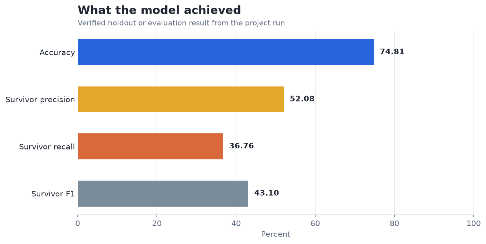
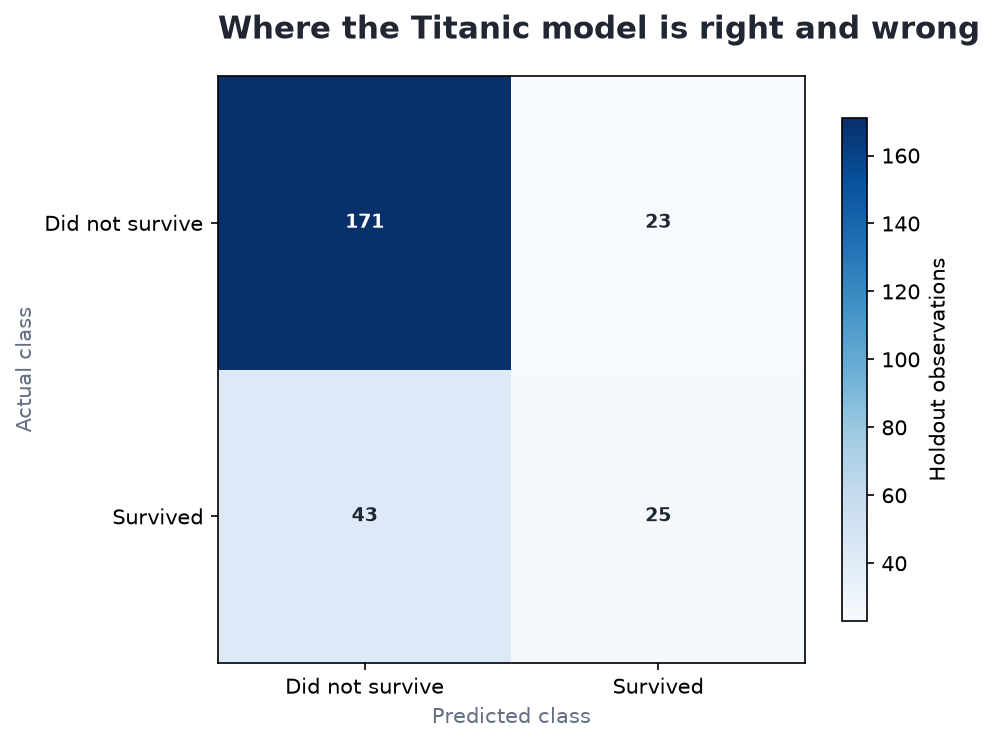

# Logistic Regression on Titanic Dataset — Analysis Report

**Author:** Edward Ocran  
**Project:** 2  
**Validation status:** Reproduced locally from the project dataset and code

## Executive Summary

- The logistic model reaches 74.81% accuracy, but identifies only 36.76% of survivors in the holdout.
- The confusion counts sharpen the result: the model correctly identifies 171 non-survivors and 25 survivors, while missing 43 survivors. Accuracy alone therefore overstates how well the positive class is served.
- **Recommended action:** Retain the model as a transparent baseline and evaluate class-level errors before comparing more complex estimators.

## Analytical Question

Can basic passenger information produce a useful Titanic survival baseline?

## Data and Evaluation Design

The Titanic file contains 1,309 passengers. Age and fare are median-imputed and standardized; sex, class, and embarkation point are imputed and one-hot encoded. A logistic regression is trained on a stratified 80% split. Accuracy, positive-class precision, recall, F1, and the four confusion-matrix counts are measured on the untouched holdout.

## Results

| Measure | Result |
|---|---:|
| Passengers | 1,309 |
| Accuracy | 74.81% |
| Survivor precision | 52.08% |
| Survivor recall | 36.76% |
| Survivor F1 | 43.10% |
| Confusion matrix (TN / FP / FN / TP) | 171 / 23 / 43 / 25 |

## Visual Evidence

## What the Evidence Says

The confusion counts sharpen the result: the model correctly identifies 171 non-survivors and 25 survivors, while missing 43 survivors. Accuracy alone therefore overstates how well the positive class is served.

## Risks and Limitations

The available evaluation is a project benchmark and should be validated on a separate operating sample before deployment.

## Recommendations

1. Retain the model as a transparent baseline and evaluate class-level errors before comparing more complex estimators.
2. Extend the validation with stronger baselines and segmented error analysis.

## Reproducibility Notes

- Run `python main.py --json` from this project folder to reproduce the headline metrics.
- Dataset acquisition and provenance are documented in `DATASET.md` where an external dataset is used.
- Rebuild these figures from the repository root with `python tools/build_analysis_reports.py`.
- Charts are stored as regular PNG files so they render directly in GitHub Markdown.
