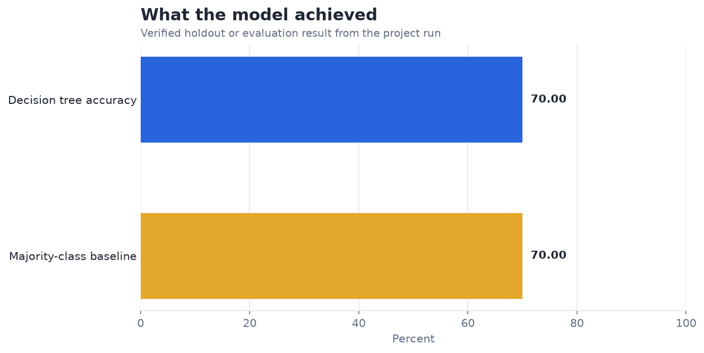
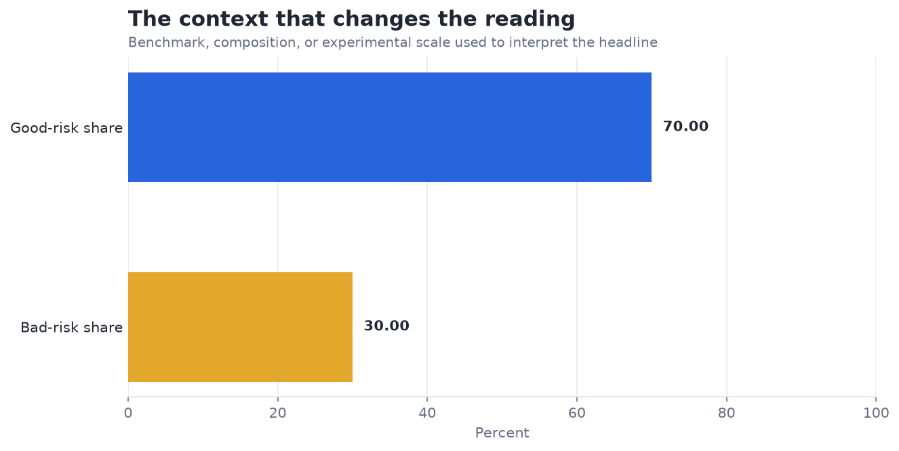

# Decision Tree Classifier for Credit Risk — Analysis Report

**Author:** Edward Ocran  
**Project:** 4  
**Validation status:** Reproduced locally from the project dataset and code

## Executive Summary

- The entropy tree reaches 70.50% accuracy, only 0.50 percentage points above the majority-class baseline.
- This is the most important finding in the project: a seemingly acceptable accuracy can offer almost no incremental decision value. Credit decisions require class-specific recall, cost-weighted errors, calibration, and fairness checks; none can be replaced by overall accuracy.
- **Recommended action:** Do not advance this specification until it beats the majority rule on cost-sensitive and class-level measures.

## Analytical Question

Does a shallow entropy tree add useful signal beyond the majority credit-risk class?

## Data and Evaluation Design

The analysis uses 1,000 records from the German Credit dataset. Categorical fields are imputed and one-hot encoded; numeric gaps are median-imputed. Following the course procedure, an entropy-based decision tree is capped at depth three and evaluated on a stratified 80/20 split.

## Results

| Measure | Result |
|---|---:|
| Applicants | 1,000 |
| Holdout accuracy | 70.50% |
| Majority-class baseline | 70.00% |

## Visual Evidence

## What the Evidence Says

This is the most important finding in the project: a seemingly acceptable accuracy can offer almost no incremental decision value. Credit decisions require class-specific recall, cost-weighted errors, calibration, and fairness checks; none can be replaced by overall accuracy.

## Risks and Limitations

The available evaluation is a project benchmark and should be validated on a separate operating sample before deployment.

## Recommendations

1. Do not advance this specification until it beats the majority rule on cost-sensitive and class-level measures.
2. Extend the validation with stronger baselines and segmented error analysis.

## Reproducibility Notes

- Run `python main.py --json` from this project folder to reproduce the headline metrics.
- Dataset acquisition and provenance are documented in `DATASET.md` where an external dataset is used.
- The committed figures correspond to the measured results documented in this report.
- Charts are stored as regular PNG files so they render directly in GitHub Markdown.
