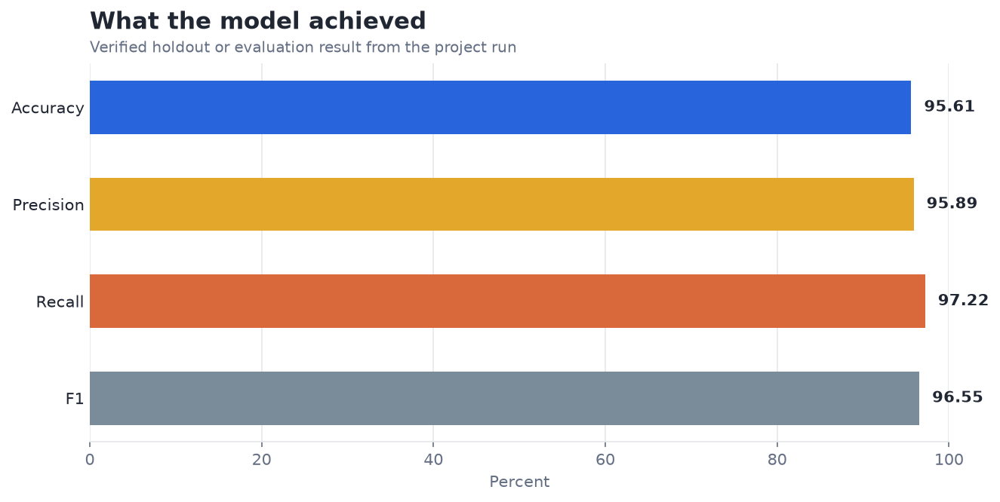
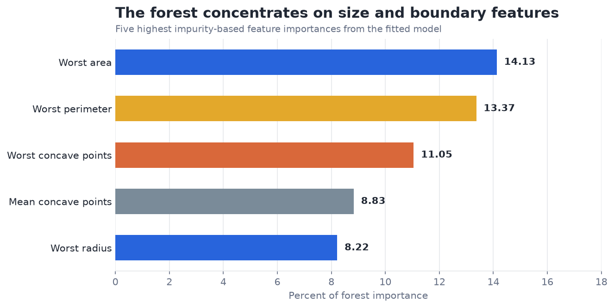

# Random Forest on Breast Cancer Dataset — Analysis Report

**Author:** Edward Ocran  
**Project:** 5  
**Validation status:** Reproduced locally from the project dataset and code

## Executive Summary

- The forest reaches 95.61% accuracy and 97.22% recall for the encoded positive class, with five errors across 114 holdout cases.
- The confusion counts show three false positives and two false negatives. The model separates this holdout well, though medical use would still require confirming which label is treated as the clinically critical class and validating sensitivity on an external cohort.
- **Recommended action:** Move next to sensitivity, specificity, calibration, and external-cohort validation.

## Analytical Question

How accurately can a random forest classify the Wisconsin diagnostic measurements?

## Data and Evaluation Design

The Wisconsin Diagnostic Breast Cancer dataset contains 569 cases and 30 measured features. A 150-tree random forest is fitted on a stratified 80% training split. The holdout evaluation includes accuracy, precision, recall, F1, confusion counts, and ranked feature importance as requested in the course procedure.

## Results

| Measure | Result |
|---|---:|
| Cases | 569 |
| Accuracy | 95.61% |
| Precision | 95.89% |
| Recall | 97.22% |
| F1 | 96.55% |
| Confusion matrix (TN / FP / FN / TP) | 39 / 3 / 2 / 70 |

## Visual Evidence

## What the Evidence Says

The confusion counts show three false positives and two false negatives. The model separates this holdout well, though medical use would still require confirming which label is treated as the clinically critical class and validating sensitivity on an external cohort.

## Risks and Limitations

The available evaluation is a project benchmark and should be validated on a separate operating sample before deployment.

## Recommendations

1. Move next to sensitivity, specificity, calibration, and external-cohort validation.
2. Extend the validation with stronger baselines and segmented error analysis.

## Reproducibility Notes

- Run `python main.py --json` from this project folder to reproduce the headline metrics.
- Dataset acquisition and provenance are documented in `DATASET.md` where an external dataset is used.
- Rebuild these figures from the repository root with `python tools/build_analysis_reports.py`.
- Charts are stored as regular PNG files so they render directly in GitHub Markdown.
