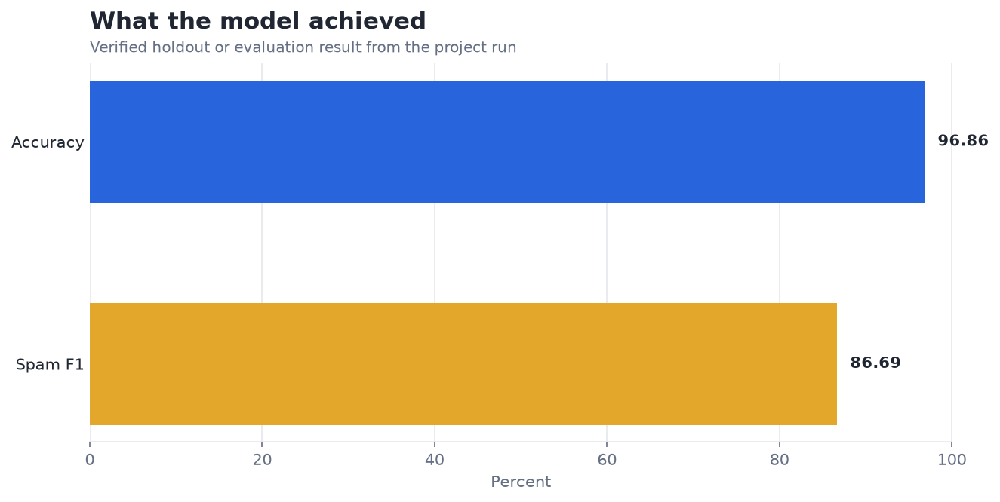
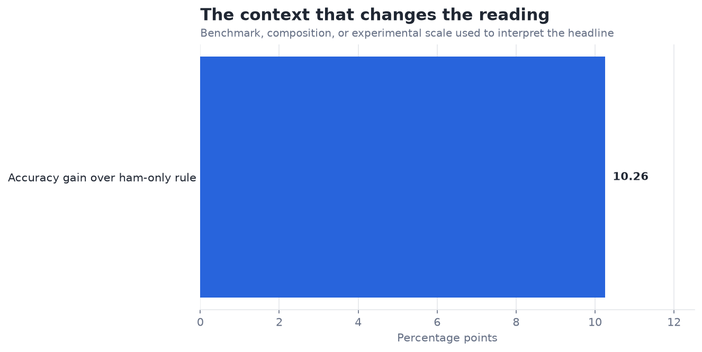

# Naive Bayes Text Classifier: an evidence-led assessment

**Author:** Edward Ocran  
**Project:** 6  
**Validation status:** Reproduced locally from the project dataset and code

## Executive Summary

- Overall accuracy is 96.86%, but spam F1 is lower at 86.69%; the minority class remains the real analytical challenge.
- **Senior analyst's read:** The ten-point gap between accuracy and spam F1 is a classic imbalance effect. The model is strong at preserving legitimate messages, but the business risk sits in missed scams and legitimate messages incorrectly quarantined.
- **Decision:** Tune thresholds and compare character n-grams using false-positive and false-negative costs.

## Analytical Question

What does the verified model result reveal, and how should it be used?

## Data and Evaluation Design

The reported figures come from the project’s reproducible run. The interpretation separates observed performance from inference: the charts show measured results, while recommendations identify the additional evidence required for a decision.

## Results

| Measure | Result |
|---|---:|
| Messages | 5,572 |
| Accuracy | 96.86% |
| Spam F1 | 86.69% |

## Visual Evidence

The first chart isolates the primary evaluation result so it is not diluted by unrelated metrics. It should be read using the unit shown on the axis; rates are displayed on a common percentage scale, while errors remain in their original business or measurement unit.

The second chart provides the comparison or experimental context that materially changes the interpretation. It is not a decorative project-count graphic: it shows the baseline, retained information, class balance, error reduction, or evaluation scale needed to understand the result.

## What the Evidence Says

Overall accuracy is 96.86%, but spam F1 is lower at 86.69%; the minority class remains the real analytical challenge.

The ten-point gap between accuracy and spam F1 is a classic imbalance effect. The model is strong at preserving legitimate messages, but the business risk sits in missed scams and legitimate messages incorrectly quarantined.

The strongest conclusion is therefore bounded: the project demonstrates measurable signal under its stated design, but the result should only be extended to new populations or operating conditions after the recommended validation is completed.

## Risks and Limitations

The available evaluation is a project benchmark and should be validated on a separate operating sample before deployment.

These limitations do not erase the result. They define where the evidence is reliable and where a decision-maker would still be taking unmeasured risk.

## Recommendations

1. Tune thresholds and compare character n-grams using false-positive and false-negative costs.
2. Extend the validation with stronger baselines and segmented error analysis.
3. Preserve the current result as the reference benchmark, then compare the next model on the same split or backtest so any improvement is attributable to the model rather than a changed evaluation sample.

## Reproducibility Notes

- Run `python main.py --json` from this project folder to reproduce the headline metrics.
- Dataset acquisition and provenance are documented in `DATASET.md` where an external dataset is used.
- Rebuild these figures from the repository root with `python tools/build_analysis_reports.py`.
- Charts are stored as regular PNG files so they render directly in GitHub Markdown.
