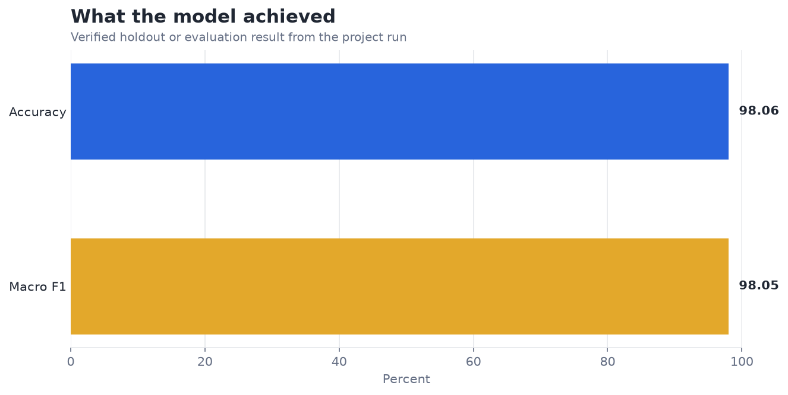
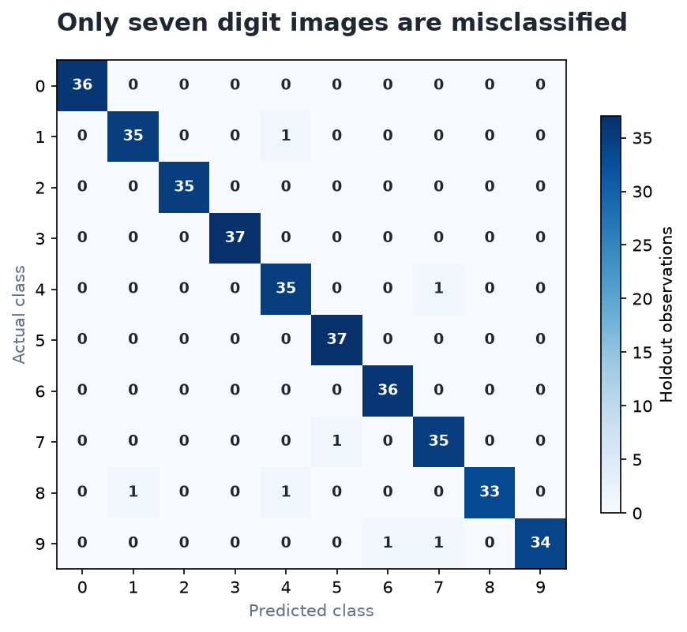

# SVM for Handwritten Digit Recognition — Analysis Report

**Author:** Edward Ocran  
**Project:** 7  
**Validation status:** Reproduced locally from the project dataset and code

## Executive Summary

- The RBF SVM classifies 98.06% of holdout digits correctly—an 88-point lift over random ten-class choice.
- Performance is strong enough that aggregate accuracy no longer reveals the main opportunity. Error concentration by digit pair and robustness to shifts, blur, and rotation will provide more useful information than another decimal place of accuracy.
- **Recommended action:** Preserve this benchmark and focus the next iteration on error taxonomy and robustness.

## Analytical Question

How well does an RBF support-vector machine recognize small handwritten digit images?

## Data and Evaluation Design

The scikit-learn handwritten-digits dataset contributes 1,797 eight-by-eight images. Pixel values are standardized and classified with an RBF support-vector machine on a stratified 80/20 split. Accuracy, macro F1, and the complete ten-class confusion matrix are emitted by the project run.

## Results

| Measure | Result |
|---|---:|
| Digit images | 1,797 |
| Accuracy | 98.06% |
| Macro F1 | 98.05% |
| Correct / incorrect holdout predictions | 353 / 7 |

## Visual Evidence

## What the Evidence Says

Performance is strong enough that aggregate accuracy no longer reveals the main opportunity. Error concentration by digit pair and robustness to shifts, blur, and rotation will provide more useful information than another decimal place of accuracy.

## Risks and Limitations

The available evaluation is a project benchmark and should be validated on a separate operating sample before deployment.

## Recommendations

1. Preserve this benchmark and focus the next iteration on error taxonomy and robustness.
2. Extend the validation with stronger baselines and segmented error analysis.

## Reproducibility Notes

- Run `python main.py --json` from this project folder to reproduce the headline metrics.
- Dataset acquisition and provenance are documented in `DATASET.md` where an external dataset is used.
- Rebuild these figures from the repository root with `python tools/build_analysis_reports.py`.
- Charts are stored as regular PNG files so they render directly in GitHub Markdown.
