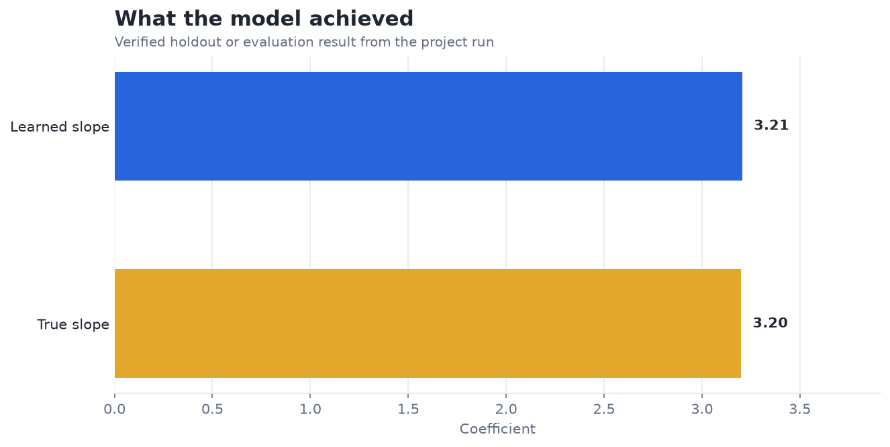
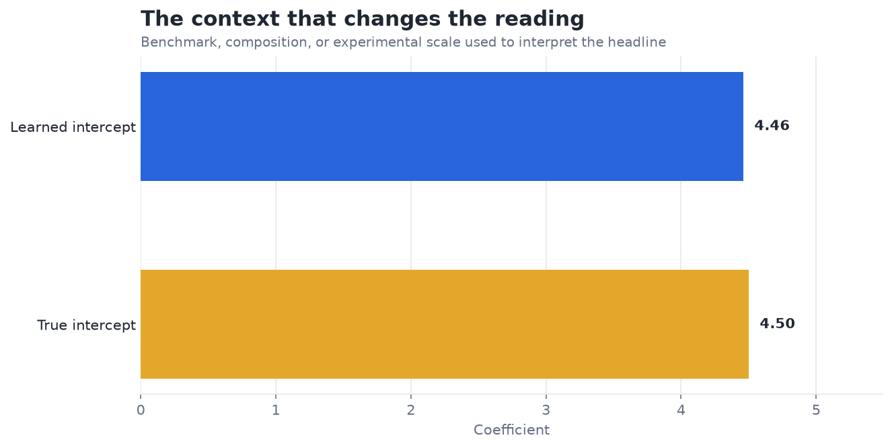

# Build Your Own Gradient Descent from Scratch — Analysis Report

**Author:** Edward Ocran  
**Project:** 9  
**Validation status:** Reproduced locally from the project dataset and code

## Executive Summary

- The hand-written optimizer reduces MSE from 498.94 to 0.0213 and recovers the generating line closely.
- The loss curve falls rapidly and then levels off, while the learned slope and intercept remain close to the values used to generate the observations. This validates the implementation on a convex, well-scaled problem.
- **Recommended action:** Treat this as an optimizer verification test and add convergence and conditioning experiments.

## Analytical Question

Can a hand-written gradient descent loop recover a known linear relationship?

## Data and Evaluation Design

One hundred linear observations are generated from a known slope of 3.2 and intercept of 4.5 with bounded random noise. Slope and intercept begin at zero and are updated for 5,000 iterations using gradients written directly in Python. MSE is recorded every 250 iterations to expose convergence rather than only the final parameters.

## Results

| Measure | Result |
|---|---:|
| Observations | 100 |
| Initial MSE | 498.941038 |
| Final MSE | 0.021286 |
| Learned slope / true slope | 3.2059 / 3.2000 |
| Learned intercept / true intercept | 4.4602 / 4.5000 |

## Visual Evidence

## What the Evidence Says

The loss curve falls rapidly and then levels off, while the learned slope and intercept remain close to the values used to generate the observations. This validates the implementation on a convex, well-scaled problem.

## Risks and Limitations

The available evaluation is a project benchmark and should be validated on a separate operating sample before deployment.

## Recommendations

1. Treat this as an optimizer verification test and add convergence and conditioning experiments.
2. Extend the validation with stronger baselines and segmented error analysis.

## Reproducibility Notes

- Run `python main.py --json` from this project folder to reproduce the headline metrics.
- Dataset acquisition and provenance are documented in `DATASET.md` where an external dataset is used.
- The committed figures correspond to the measured results documented in this report.
- Charts are stored as regular PNG files so they render directly in GitHub Markdown.
