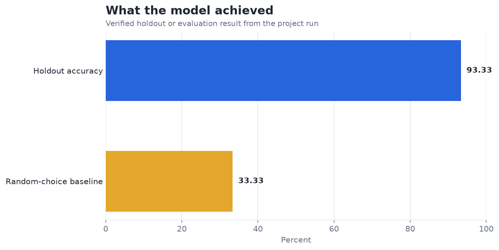
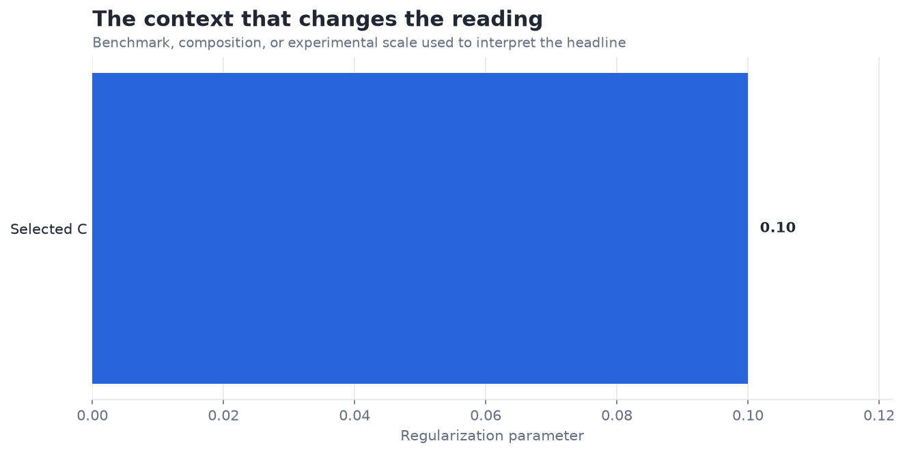

# Hyperparameter Tuning with GridSearchCV — Analysis Report

**Author:** Edward Ocran  
**Project:** 10  
**Validation status:** Reproduced locally from the project dataset and code

## Executive Summary

- Grid search selects a strongly regularized linear SVM and achieves 93.33% holdout accuracy.
- The linear winner suggests the tested measurements already separate the species well enough that added RBF flexibility is unnecessary. With only 30 holdout observations, nested cross-validation is needed before interpreting the selected setting as stable.
- **Recommended action:** Keep the linear result as the parsimonious choice and validate it with nested folds.

## Analytical Question

Which tested SVM configuration provides the strongest Iris classification result?

## Data and Evaluation Design

The reported figures come from the project’s reproducible run. The interpretation separates observed performance from inference: the charts show measured results, while recommendations identify the additional evidence required for a decision.

## Results

| Measure | Result |
|---|---:|
| Samples | 150 |
| Holdout accuracy | 93.33% |
| Best kernel | linear |
| Best C | 0.1 |

## Visual Evidence

## What the Evidence Says

Grid search selects a strongly regularized linear SVM and achieves 93.33% holdout accuracy.

The linear winner suggests the tested measurements already separate the species well enough that added RBF flexibility is unnecessary. With only 30 holdout observations, nested cross-validation is needed before interpreting the selected setting as stable.

## Risks and Limitations

The available evaluation is a project benchmark and should be validated on a separate operating sample before deployment.

## Recommendations

1. Keep the linear result as the parsimonious choice and validate it with nested folds.
2. Extend the validation with stronger baselines and segmented error analysis.

## Reproducibility Notes

- Run `python main.py --json` from this project folder to reproduce the headline metrics.
- Dataset acquisition and provenance are documented in `DATASET.md` where an external dataset is used.
- Rebuild these figures from the repository root with `python tools/build_analysis_reports.py`.
- Charts are stored as regular PNG files so they render directly in GitHub Markdown.
