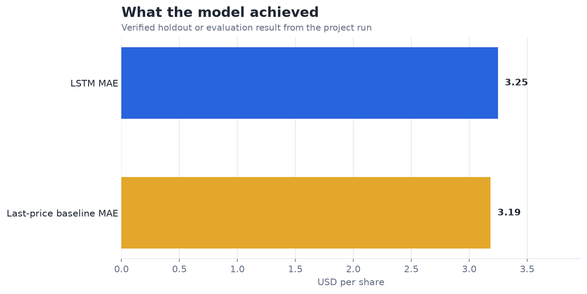
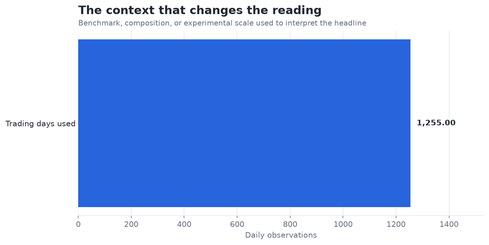

# Predict Stock Prices with LSTM — Analysis Report

**Author:** Edward Ocran  
**Project:** 11  
**Validation status:** Reproduced locally from the project dataset and code

## Executive Summary

- The trained LSTM records $3.25 MAE, nearly level with but slightly worse than the $3.19 last-price baseline.
- The model has learned a stable next-day forecast, but it has not demonstrated incremental predictive value over price persistence. The 6-cent MAE gap is small, yet the simpler baseline remains the better choice on this holdout.
- **Recommended action:** Keep the last-price forecast as the current benchmark; the LSTM has not earned a complexity advantage.

## Analytical Question

Does a trained LSTM improve next-day AAPL forecasts over using the latest closing price?

## Data and Evaluation Design

The run uses 1,255 adjusted AAPL daily closing prices downloaded through `yfinance`. Sixty-day sequences feed a trained TensorFlow LSTM with 32 recurrent units and a dense output. The last 20% of observations form a chronological holdout. A last-price forecast is evaluated on exactly the same dates as the required LSTM benchmark.

## Results

| Measure | Result |
|---|---:|
| Trading days | 1,255 |
| LSTM holdout MAE | $3.2475 |
| Last-price baseline MAE | $3.1850 |

## Visual Evidence

## What the Evidence Says

The model has learned a stable next-day forecast, but it has not demonstrated incremental predictive value over price persistence. The 6-cent MAE gap is small, yet the simpler baseline remains the better choice on this holdout.

## Risks and Limitations

The evaluation covers one ticker and one chronological holdout. The model does not include volume, corporate events, macroeconomic variables, or trading costs. It is a forecasting exercise, not trading advice.

## Recommendations

1. Keep the last-price forecast as the current benchmark; the LSTM has not earned a complexity advantage.
2. Use rolling-origin retraining, compare directional accuracy, and test whether volume or volatility features improve on the last-price baseline.

## Reproducibility Notes

- Run `python main.py --json` from this project folder to reproduce the headline metrics.
- Dataset acquisition and provenance are documented in `DATASET.md` where an external dataset is used.
- The committed figures correspond to the measured results documented in this report.
- Charts are stored as regular PNG files so they render directly in GitHub Markdown.
