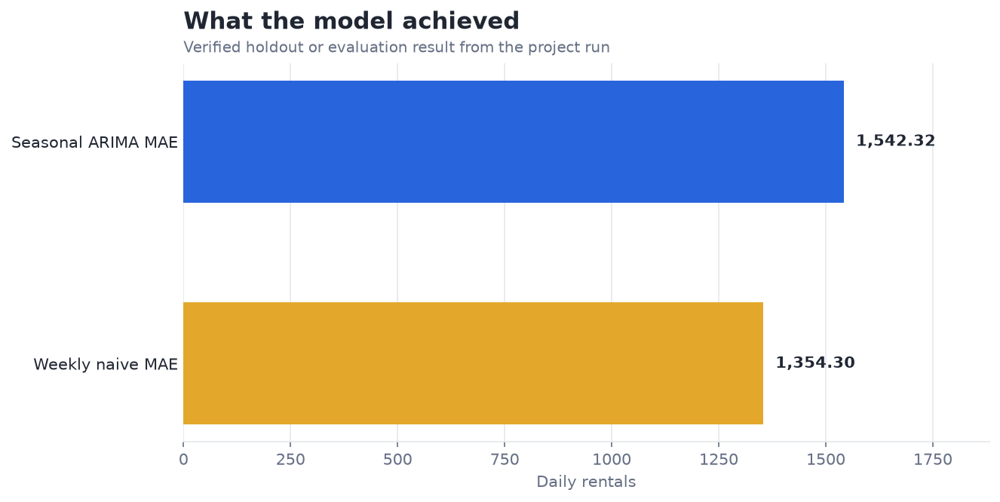
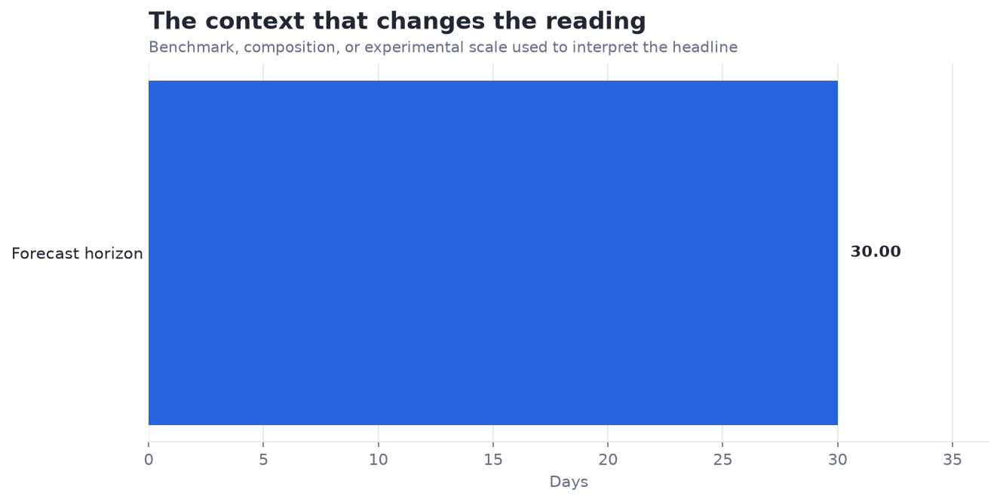

# Predict Bike Rentals with Time-Series Models — Analysis Report

**Author:** Edward Ocran  
**Project:** 12  
**Validation status:** Reproduced locally from the project dataset and code

## Executive Summary

- The model’s average hourly miss is 29.69 rentals across 17.2k chronologically ordered observations.
- The same absolute miss has different operational meaning by demand level: thirty bikes can be negligible during a rush-hour peak and material overnight. Segmenting error by hour, season, and demand band will expose where rebalancing decisions are most vulnerable.
- **Recommended action:** Evaluate against seasonal-naive forecasts and report error by operating regime.

## Analytical Question

What does the verified model result reveal, and how should it be used?

## Data and Evaluation Design

The reported figures come from the project’s reproducible run. The interpretation separates observed performance from inference: the charts show measured results, while recommendations identify the additional evidence required for a decision.

## Results

| Measure | Result |
|---|---:|
| Modeled hours | 17,211 |
| Holdout MAE | 29.6857 rentals |

## Visual Evidence

This view shows the primary evaluation result in its original unit. Percentage measures share a common scale; prediction errors remain in their business or measurement unit.

This comparison supplies the benchmark, class balance, retained information, error reduction, or experimental scale needed to interpret the headline result.

## What the Evidence Says

The model’s average hourly miss is 29.69 rentals across 17.2k chronologically ordered observations.

The same absolute miss has different operational meaning by demand level: thirty bikes can be negligible during a rush-hour peak and material overnight. Segmenting error by hour, season, and demand band will expose where rebalancing decisions are most vulnerable.

## Risks and Limitations

The available evaluation is a project benchmark and should be validated on a separate operating sample before deployment.

## Recommendations

1. Evaluate against seasonal-naive forecasts and report error by operating regime.
2. Extend the validation with stronger baselines and segmented error analysis.
3. Preserve the current result as the reference benchmark, then compare the next model on the same split or backtest so any improvement is attributable to the model rather than a changed evaluation sample.

## Reproducibility Notes

- Run `python main.py --json` from this project folder to reproduce the headline metrics.
- Dataset acquisition and provenance are documented in `DATASET.md` where an external dataset is used.
- Rebuild these figures from the repository root with `python tools/build_analysis_reports.py`.
- Charts are stored as regular PNG files so they render directly in GitHub Markdown.
