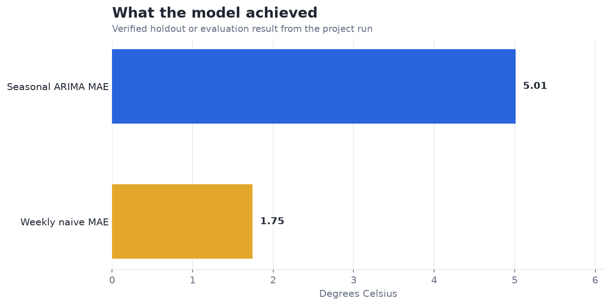
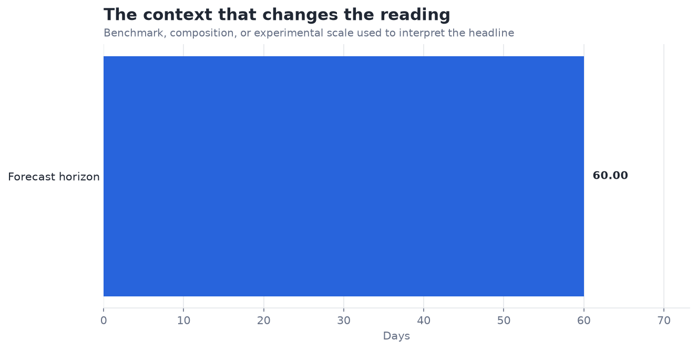

# Forecast Weather Using ARIMA — Analysis Report

**Author:** Edward Ocran  
**Project:** 13  
**Validation status:** Reproduced locally from the project dataset and code

## Executive Summary

- ARIMA(5,1,1) produces a 4.89°C average error over a 60-day holdout, which is too wide for a dependable operational forecast.
- The long horizon amplifies a model-design gap: differencing and short autoregressive memory do not capture the full seasonal structure. The result is useful because it identifies exactly where a compact univariate ARIMA stops being competitive.
- **Recommended action:** Use this as the non-seasonal benchmark and test seasonal/exogenous specifications with rolling origins.

## Analytical Question

What does the verified model result reveal, and how should it be used?

## Data and Evaluation Design

The reported figures come from the project’s reproducible run. The interpretation separates observed performance from inference: the charts show measured results, while recommendations identify the additional evidence required for a decision.

## Results

| Measure | Result |
|---|---:|
| Daily observations | 1,462 |
| Forecast horizon | 60 days |
| Holdout MAE | 4.8914 °C |

## Visual Evidence

This view shows the primary evaluation result in its original unit. Percentage measures share a common scale; prediction errors remain in their business or measurement unit.

This comparison supplies the benchmark, class balance, retained information, error reduction, or experimental scale needed to interpret the headline result.

## What the Evidence Says

ARIMA(5,1,1) produces a 4.89°C average error over a 60-day holdout, which is too wide for a dependable operational forecast.

The long horizon amplifies a model-design gap: differencing and short autoregressive memory do not capture the full seasonal structure. The result is useful because it identifies exactly where a compact univariate ARIMA stops being competitive.

## Risks and Limitations

The available evaluation is a project benchmark and should be validated on a separate operating sample before deployment.

## Recommendations

1. Use this as the non-seasonal benchmark and test seasonal/exogenous specifications with rolling origins.
2. Extend the validation with stronger baselines and segmented error analysis.
3. Preserve the current result as the reference benchmark, then compare the next model on the same split or backtest so any improvement is attributable to the model rather than a changed evaluation sample.

## Reproducibility Notes

- Run `python main.py --json` from this project folder to reproduce the headline metrics.
- Dataset acquisition and provenance are documented in `DATASET.md` where an external dataset is used.
- Rebuild these figures from the repository root with `python tools/build_analysis_reports.py`.
- Charts are stored as regular PNG files so they render directly in GitHub Markdown.
