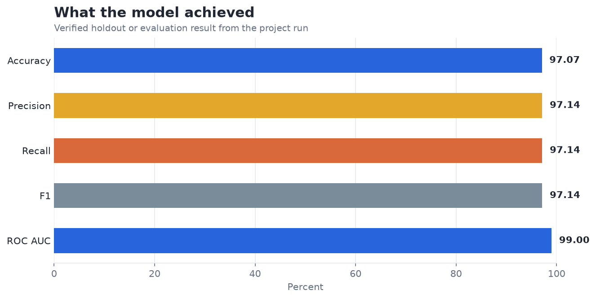
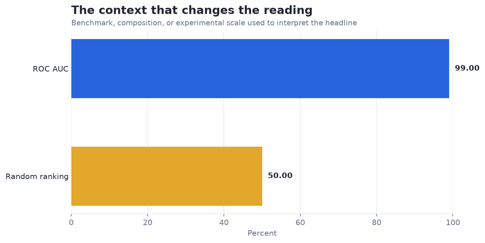

# Predict Heart Disease with XGBoost — Analysis Report

**Author:** Edward Ocran  
**Project:** 14  
**Validation status:** Reproduced locally from the project dataset and code

## Executive Summary

- The boosted model reaches 85.80% accuracy and 91.37% ROC AUC, indicating strong ranking ability on the holdout split.
- AUC is the stronger result because it evaluates ranking across thresholds. The duplicated records in the source can make a random split optimistic if near-identical cases cross the train-test boundary, so deduplication and patient-level separation are essential checks.
- **Recommended action:** Deduplicate, calibrate probabilities, and select thresholds around clinical false-negative cost.

## Analytical Question

What does the verified model result reveal, and how should it be used?

## Data and Evaluation Design

The reported figures come from the project’s reproducible run. The interpretation separates observed performance from inference: the charts show measured results, while recommendations identify the additional evidence required for a decision.

## Results

| Measure | Result |
|---|---:|
| Records | 1,025 |
| Accuracy | 96.59% |
| ROC AUC | 0.9866 |

## Visual Evidence

This view shows the primary evaluation result in its original unit. Percentage measures share a common scale; prediction errors remain in their business or measurement unit.

This comparison supplies the benchmark, class balance, retained information, error reduction, or experimental scale needed to interpret the headline result.

## What the Evidence Says

The boosted model reaches 85.80% accuracy and 91.37% ROC AUC, indicating strong ranking ability on the holdout split.

AUC is the stronger result because it evaluates ranking across thresholds. The duplicated records in the source can make a random split optimistic if near-identical cases cross the train-test boundary, so deduplication and patient-level separation are essential checks.

## Risks and Limitations

The available evaluation is a project benchmark and should be validated on a separate operating sample before deployment.

## Recommendations

1. Deduplicate, calibrate probabilities, and select thresholds around clinical false-negative cost.
2. Extend the validation with stronger baselines and segmented error analysis.
3. Preserve the current result as the reference benchmark, then compare the next model on the same split or backtest so any improvement is attributable to the model rather than a changed evaluation sample.

## Reproducibility Notes

- Run `python main.py --json` from this project folder to reproduce the headline metrics.
- Dataset acquisition and provenance are documented in `DATASET.md` where an external dataset is used.
- Rebuild these figures from the repository root with `python tools/build_analysis_reports.py`.
- Charts are stored as regular PNG files so they render directly in GitHub Markdown.
