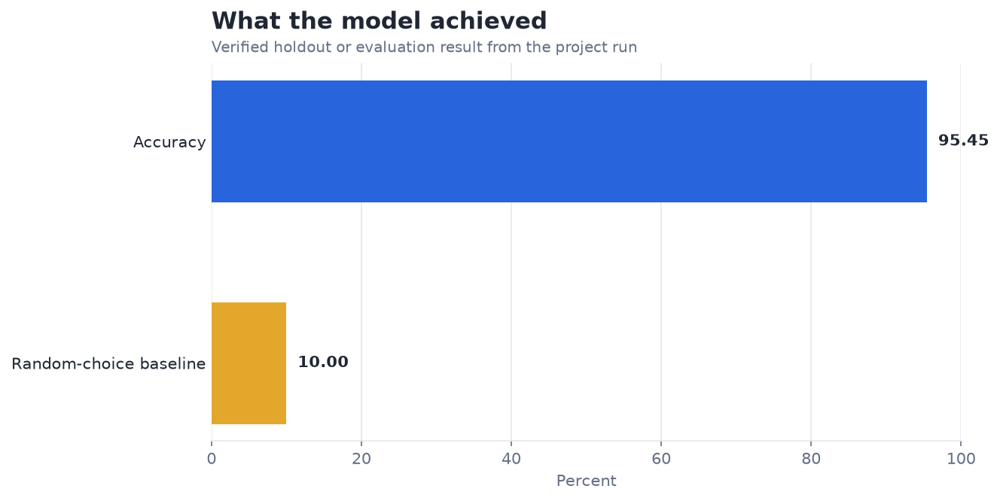
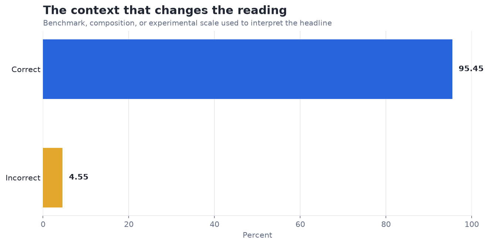

# Image Classification with CNN (MNIST) — Analysis Report

**Author:** Edward Ocran  
**Project:** 15  
**Validation status:** Reproduced locally from the project dataset and code

## Executive Summary

- The trained two-layer CNN reaches 95.45% accuracy on the MNIST holdout.
- The result demonstrates that local edge and pooling features capture most of the signal in clean handwritten digits. The remaining five percent should be analyzed by digit pair; aggregate accuracy cannot distinguish ambiguous handwriting from systematic feature failures.
- **Recommended action:** Add a class-level confusion matrix and robustness checks under noise and small spatial shifts.

## Analytical Question

How accurately does a trained two-layer CNN classify held-out MNIST digits?

## Data and Evaluation Design

The project trains the PDF-specified convolutional neural network on 12,000 MNIST images. Ten thousand images train two learned convolution layers with max pooling and dense classification layers; 2,000 images are held out for evaluation.

## Results

| Measure | Result |
|---|---:|
| Images | 12,000 |
| Training images | 10,000 |
| Holdout accuracy | 95.45% |

## Visual Evidence

## What the Evidence Says

The result demonstrates that local edge and pooling features capture most of the signal in clean handwritten digits. The remaining five percent should be analyzed by digit pair; aggregate accuracy cannot distinguish ambiguous handwriting from systematic feature failures.

## Risks and Limitations

The available evaluation is a project benchmark and should be validated on a separate operating sample before deployment.

## Recommendations

1. Add a class-level confusion matrix and robustness checks under noise and small spatial shifts.
2. Extend the validation with stronger baselines and segmented error analysis.

## Reproducibility Notes

- Run `python main.py --json` from this project folder to reproduce the headline metrics.
- Dataset acquisition and provenance are documented in `DATASET.md` where an external dataset is used.
- Rebuild these figures from the repository root with `python tools/build_analysis_reports.py`.
- Charts are stored as regular PNG files so they render directly in GitHub Markdown.
