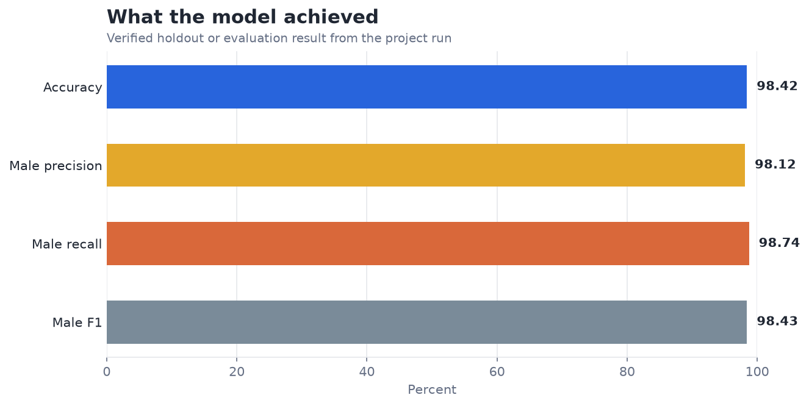
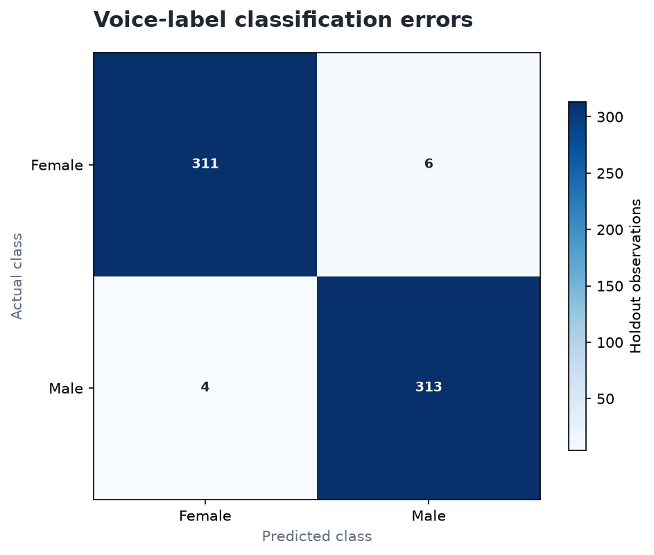

# Voice Gender Classifier — Analysis Report

**Author:** Edward Ocran  
**Project:** 16  
**Validation status:** Reproduced locally from the project dataset and code

## Executive Summary

- The voice classifier records 98.42% holdout accuracy, with ten errors across 634 recordings.
- The high score is evidence that the engineered frequency features separate the dataset labels well. It should not be generalized to gender identity or deployed on unseen microphones, languages, age groups, or recording conditions without broader validation.
- **Recommended action:** Test speaker-disjoint splits and report calibration and subgroup performance.

## Analytical Question

How well do the supplied acoustic measurements separate the dataset's voice labels?

## Data and Evaluation Design

The voice-recognition table contains 3,168 recordings described by measured acoustic features. A 180-tree random forest is fitted on a stratified 80% split. The holdout evaluation reports overall accuracy, male-class precision, recall and F1, plus the four confusion counts.

## Results

| Measure | Result |
|---|---:|
| Recordings | 3,168 |
| Accuracy | 98.42% |
| Male precision | 98.12% |
| Male recall | 98.74% |
| Male F1 | 98.43% |
| Confusion matrix (TN / FP / FN / TP) | 311 / 6 / 4 / 313 |

## Visual Evidence

## What the Evidence Says

The high score is evidence that the engineered frequency features separate the dataset labels well. It should not be generalized to gender identity or deployed on unseen microphones, languages, age groups, or recording conditions without broader validation.

## Risks and Limitations

The available evaluation is a project benchmark and should be validated on a separate operating sample before deployment.

## Recommendations

1. Test speaker-disjoint splits and report calibration and subgroup performance.
2. Extend the validation with stronger baselines and segmented error analysis.

## Reproducibility Notes

- Run `python main.py --json` from this project folder to reproduce the headline metrics.
- Dataset acquisition and provenance are documented in `DATASET.md` where an external dataset is used.
- Rebuild these figures from the repository root with `python tools/build_analysis_reports.py`.
- Charts are stored as regular PNG files so they render directly in GitHub Markdown.
