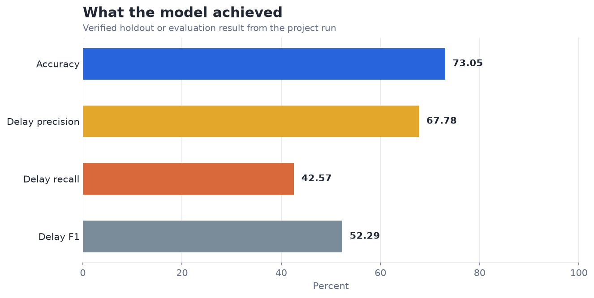
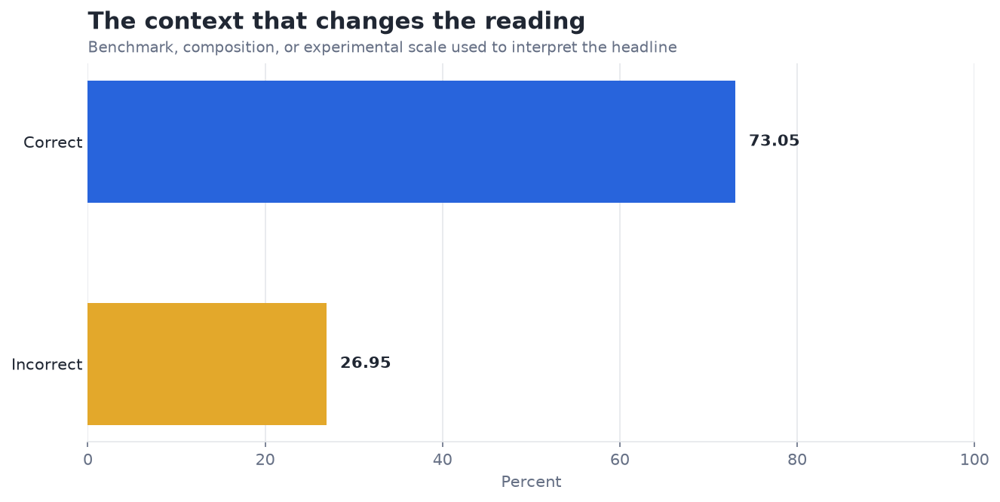

# Flight Delay Predictor — Analysis Report

**Author:** Edward Ocran  
**Project:** 17  
**Validation status:** Reproduced locally from the project dataset and code

## Executive Summary

- The gradient-boosted flight model reaches 73.05% accuracy, but detects only 42.57% of delayed arrivals.
- Precision is materially stronger than recall: when the model flags a delay it is right 67.78% of the time, yet it misses more than half of actual delays. That tradeoff limits its usefulness for proactive passenger or staffing decisions.
- **Recommended action:** Report precision-recall tradeoffs and performance by carrier and time block.

## Analytical Question

How reliably can schedule and route information identify delayed flights?

## Data and Evaluation Design

The project uses 73,111 non-cancelled records from the 2015 U.S. flight-delay dataset. Calendar, route, airline, scheduled departure, and distance fields are prepared without using arrival information available only after the prediction point. A 100-tree gradient boosting classifier is fitted on a stratified 80% split and evaluated on the untouched holdout.

## Results

| Measure | Result |
|---|---:|
| Flights | 73,111 |
| Accuracy | 73.05% |
| Delay precision | 67.78% |
| Delay recall | 42.57% |
| Delay F1 | 52.29% |

## Visual Evidence

## What the Evidence Says

Precision is materially stronger than recall: when the model flags a delay it is right 67.78% of the time, yet it misses more than half of actual delays. That tradeoff limits its usefulness for proactive passenger or staffing decisions.

## Risks and Limitations

The available evaluation is a project benchmark and should be validated on a separate operating sample before deployment.

## Recommendations

1. Report precision-recall tradeoffs and performance by carrier and time block.
2. Extend the validation with stronger baselines and segmented error analysis.

## Reproducibility Notes

- Run `python main.py --json` from this project folder to reproduce the headline metrics.
- Dataset acquisition and provenance are documented in `DATASET.md` where an external dataset is used.
- Rebuild these figures from the repository root with `python tools/build_analysis_reports.py`.
- Charts are stored as regular PNG files so they render directly in GitHub Markdown.
