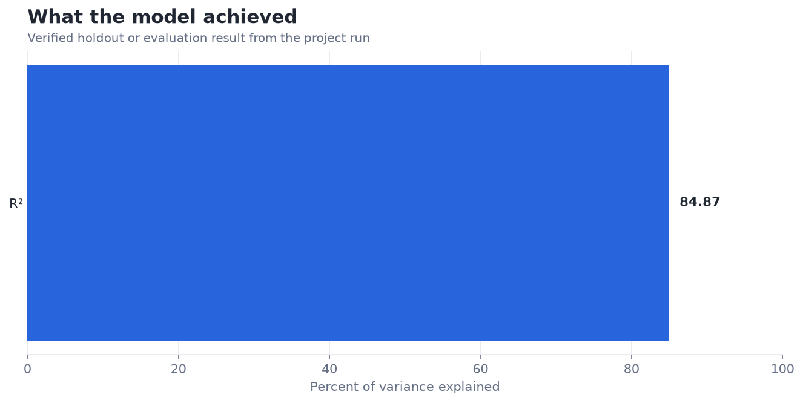
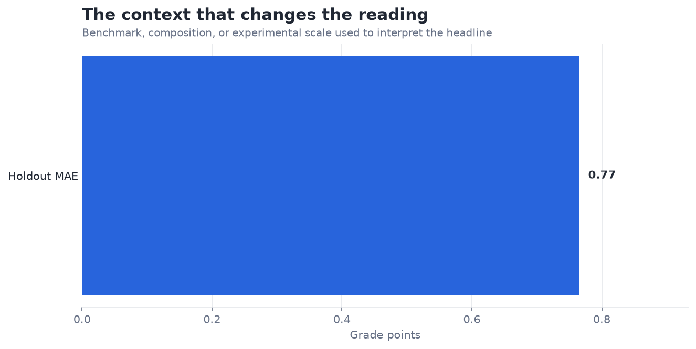

# Student Grade Predictor with Linear Regression — Analysis Report

**Author:** Edward Ocran  
**Project:** 18  
**Validation status:** Reproduced locally from the project dataset and code

## Executive Summary

- The linear regression explains 84.87% of holdout variance and misses final grade by 0.77 points on average.
- This is a strong forecast, but earlier course grades likely dominate the signal. That makes the model better suited to late-course forecasting than early intervention; a version excluding prior grades is the more honest test of proactive usefulness.
- **Recommended action:** Compare performance with and without earlier grades and validate by school.

## Analytical Question

How closely can student and school attributes predict the final Portuguese-course grade?

## Data and Evaluation Design

The UCI Portuguese student file contains 649 records. Numeric variables are standardized, categorical variables are one-hot encoded, and an ordinary linear regression—the model specified in the PDF—is evaluated on a fixed 20% holdout.

## Results

| Measure | Result |
|---|---:|
| Students | 649 |
| Holdout MAE | 0.7651 grade points |
| Holdout R² | 0.8487 |

## Visual Evidence

## What the Evidence Says

This is a strong forecast, but earlier course grades likely dominate the signal. That makes the model better suited to late-course forecasting than early intervention; a version excluding prior grades is the more honest test of proactive usefulness.

## Risks and Limitations

The available evaluation is a project benchmark and should be validated on a separate operating sample before deployment.

## Recommendations

1. Compare performance with and without earlier grades and validate by school.
2. Extend the validation with stronger baselines and segmented error analysis.

## Reproducibility Notes

- Run `python main.py --json` from this project folder to reproduce the headline metrics.
- Dataset acquisition and provenance are documented in `DATASET.md` where an external dataset is used.
- Rebuild these figures from the repository root with `python tools/build_analysis_reports.py`.
- Charts are stored as regular PNG files so they render directly in GitHub Markdown.
