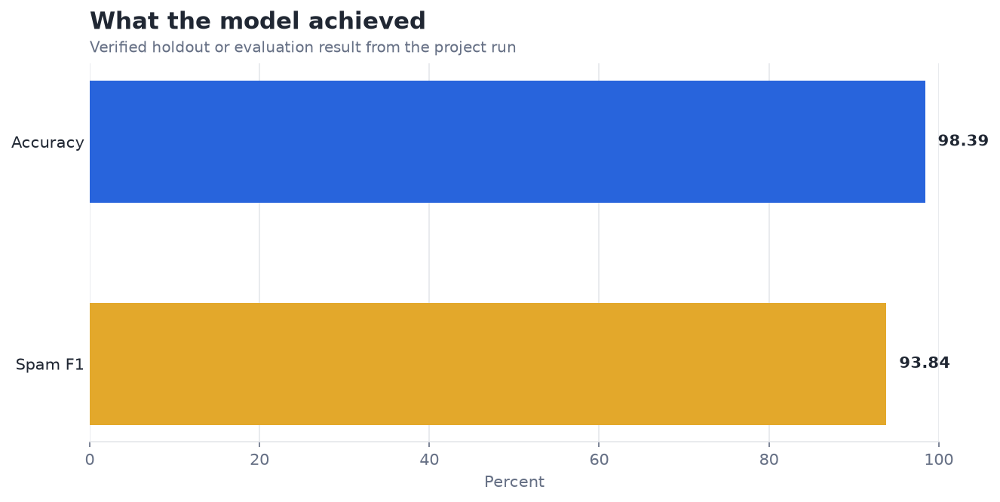
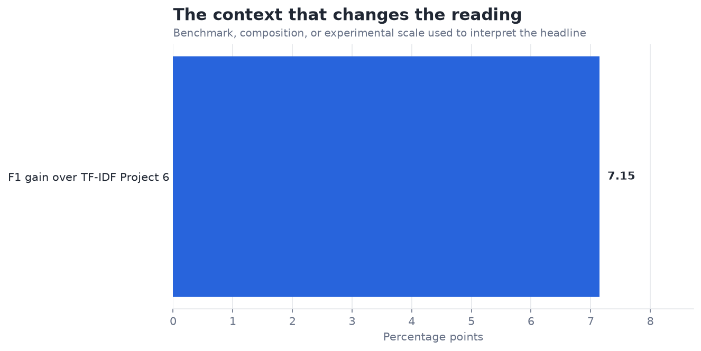

# Spam Detection with MultinomialNB — Analysis Report

**Author:** Edward Ocran  
**Project:** 19  
**Validation status:** Reproduced locally from the project dataset and code

## Executive Summary

- Count features produce 98.39% accuracy and 93.84% spam F1, a 7.15-point F1 improvement over the TF-IDF baseline in Project 6.
- Repeated token evidence appears especially useful for this corpus. Because the two projects rely on one split, the comparison is promising rather than conclusive; deduplication and repeated shared folds are needed to isolate representation effects.
- **Recommended action:** Advance count features to repeated cross-validation and false-positive review.

## Analytical Question

What does the verified model result reveal, and how should it be used?

## Data and Evaluation Design

The reported figures come from the project’s reproducible run. The interpretation separates observed performance from inference: the charts show measured results, while recommendations identify the additional evidence required for a decision.

## Results

| Measure | Result |
|---|---:|
| Messages | 5,572 |
| Accuracy | 98.39% |
| Spam F1 | 93.84% |

## Visual Evidence

This view shows the primary evaluation result in its original unit. Percentage measures share a common scale; prediction errors remain in their business or measurement unit.

This comparison supplies the benchmark, class balance, retained information, error reduction, or experimental scale needed to interpret the headline result.

## What the Evidence Says

Count features produce 98.39% accuracy and 93.84% spam F1, a 7.15-point F1 improvement over the TF-IDF baseline in Project 6.

Repeated token evidence appears especially useful for this corpus. Because the two projects rely on one split, the comparison is promising rather than conclusive; deduplication and repeated shared folds are needed to isolate representation effects.

## Risks and Limitations

The available evaluation is a project benchmark and should be validated on a separate operating sample before deployment.

## Recommendations

1. Advance count features to repeated cross-validation and false-positive review.
2. Extend the validation with stronger baselines and segmented error analysis.
3. Preserve the current result as the reference benchmark, then compare the next model on the same split or backtest so any improvement is attributable to the model rather than a changed evaluation sample.

## Reproducibility Notes

- Run `python main.py --json` from this project folder to reproduce the headline metrics.
- Dataset acquisition and provenance are documented in `DATASET.md` where an external dataset is used.
- Rebuild these figures from the repository root with `python tools/build_analysis_reports.py`.
- Charts are stored as regular PNG files so they render directly in GitHub Markdown.
