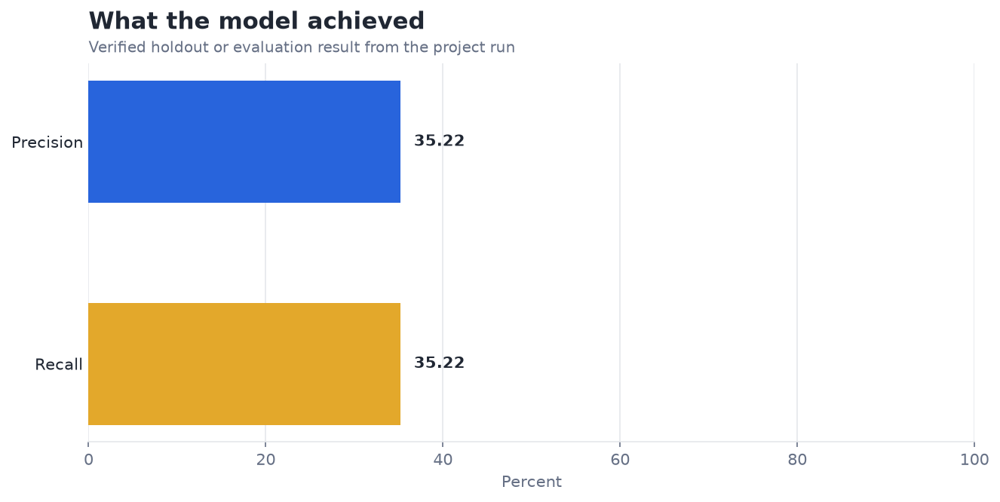
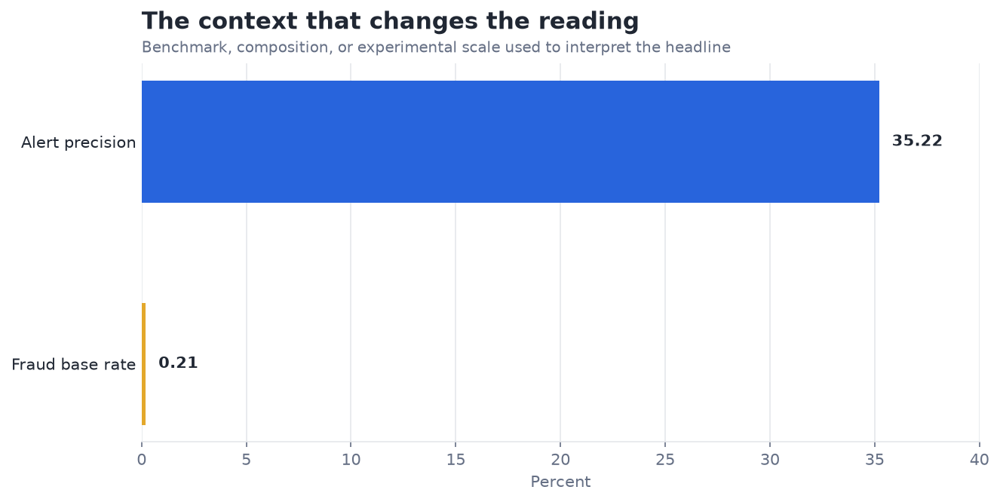

# Fraud Detection with Isolation Forests — Analysis Report

**Author:** Edward Ocran  
**Project:** 20  
**Validation status:** Reproduced locally from the project dataset and code

## Executive Summary

- The detector captures 35.22% of fraud and 35.22% of its alerts are true fraud—far above the 0.206% base rate, but incomplete for stand-alone decisions.
- Precision is roughly 171 times the raw fraud rate, so anomaly scoring creates genuine investigative lift. The operating issue is coverage: almost two thirds of fraud remains unflagged, while almost two thirds of alerts still require review and turn out not to be fraud.
- **Recommended action:** Use the score for triage, then tune alert volume against investigator capacity on a chronological holdout.

## Analytical Question

Can an unsupervised isolation forest surface fraudulent transactions at a useful alert rate?

## Data and Evaluation Design

The reported figures come from the project’s reproducible run. The interpretation separates observed performance from inference: the charts show measured results, while recommendations identify the additional evidence required for a decision.

## Results

| Measure | Result |
|---|---:|
| Transactions | 120,000 |
| Fraud records | 247 |
| Precision | 35.22% |
| Recall | 35.22% |

## Visual Evidence

## What the Evidence Says

The detector captures 35.22% of fraud and 35.22% of its alerts are true fraud—far above the 0.206% base rate, but incomplete for stand-alone decisions.

Precision is roughly 171 times the raw fraud rate, so anomaly scoring creates genuine investigative lift. The operating issue is coverage: almost two thirds of fraud remains unflagged, while almost two thirds of alerts still require review and turn out not to be fraud.

## Risks and Limitations

The available evaluation is a project benchmark and should be validated on a separate operating sample before deployment.

## Recommendations

1. Use the score for triage, then tune alert volume against investigator capacity on a chronological holdout.
2. Extend the validation with stronger baselines and segmented error analysis.

## Reproducibility Notes

- Run `python main.py --json` from this project folder to reproduce the headline metrics.
- Dataset acquisition and provenance are documented in `DATASET.md` where an external dataset is used.
- Rebuild these figures from the repository root with `python tools/build_analysis_reports.py`.
- Charts are stored as regular PNG files so they render directly in GitHub Markdown.
