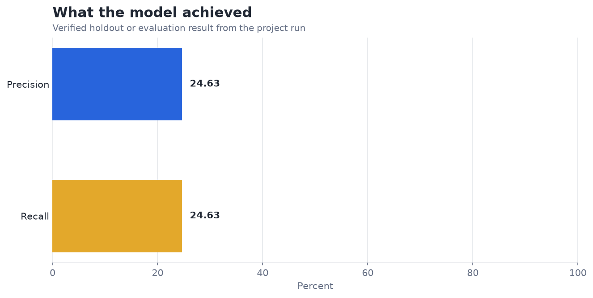
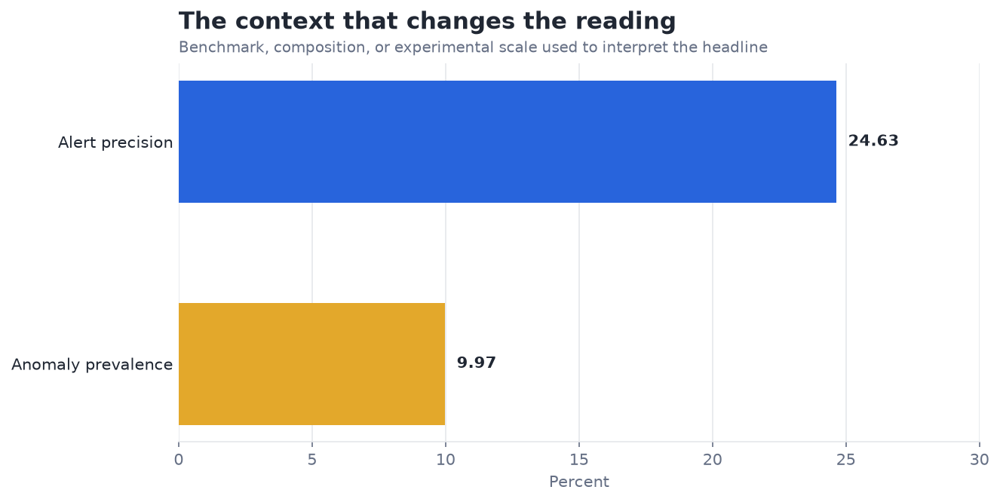

# Anomaly Detection in Server Logs — Analysis Report

**Author:** Edward Ocran  
**Project:** 21  
**Validation status:** Reproduced locally from the project dataset and code

## Executive Summary

- The isolation forest captures 24.63% of labeled anomaly points with 24.63% precision on 4,032 CPU observations.
- The detector lifts precision to about 2.5 times the anomaly prevalence, but misses roughly three quarters of the labeled window. Point-level scoring also penalizes a detector that identifies part of an incident window, so event-level detection delay should accompany precision and recall.
- **Recommended action:** Treat this as a triage baseline and evaluate event coverage, delay, and false alerts per day.

## Analytical Question

Can unsupervised anomaly scoring detect labeled abnormal windows in server CPU telemetry?

## Data and Evaluation Design

The reported figures come from the project’s reproducible run. The interpretation separates observed performance from inference: the charts show measured results, while recommendations identify the additional evidence required for a decision.

## Results

| Measure | Result |
|---|---:|
| Observations | 4,032 |
| Labeled anomaly points | 402 |
| Precision | 24.63% |
| Recall | 24.63% |

## Visual Evidence

## What the Evidence Says

The isolation forest captures 24.63% of labeled anomaly points with 24.63% precision on 4,032 CPU observations.

The detector lifts precision to about 2.5 times the anomaly prevalence, but misses roughly three quarters of the labeled window. Point-level scoring also penalizes a detector that identifies part of an incident window, so event-level detection delay should accompany precision and recall.

## Risks and Limitations

The available evaluation is a project benchmark and should be validated on a separate operating sample before deployment.

## Recommendations

1. Treat this as a triage baseline and evaluate event coverage, delay, and false alerts per day.
2. Extend the validation with stronger baselines and segmented error analysis.

## Reproducibility Notes

- Run `python main.py --json` from this project folder to reproduce the headline metrics.
- Dataset acquisition and provenance are documented in `DATASET.md` where an external dataset is used.
- The committed figures correspond to the measured results documented in this report.
- Charts are stored as regular PNG files so they render directly in GitHub Markdown.
