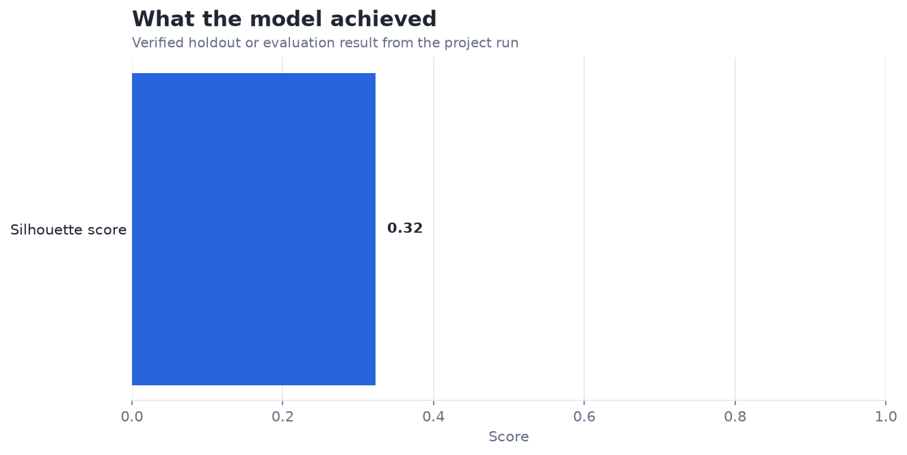
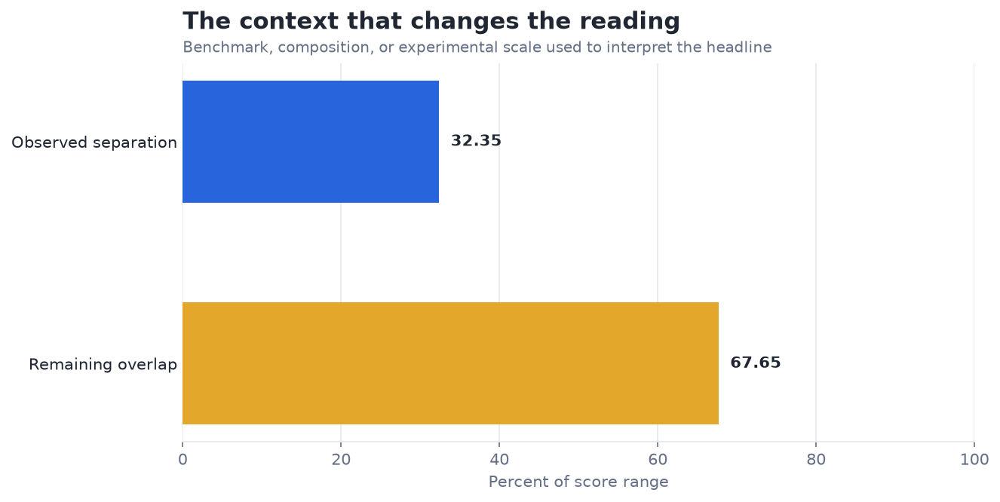

# Clustering Movie Genres with K-Means — Analysis Report

**Author:** Edward Ocran  
**Project:** 23  
**Validation status:** Reproduced locally from the project dataset and code

## Executive Summary

- Twelve genre clusters produce a 0.3235 silhouette score across 9,742 MovieLens titles, indicating overlapping but interpretable groupings.
- Genre labels are multi-valued, so overlap is structurally expected: a film can bridge comedy, drama, romance, and other categories. Cluster profiles are therefore more useful as catalog neighborhoods than as rigid genre replacements.
- **Recommended action:** Inspect cluster genre compositions and test recommendation usefulness rather than chasing separation alone.

## Analytical Question

Do MovieLens genre combinations form useful K-means catalog neighborhoods?

## Data and Evaluation Design

The reported figures come from the project’s reproducible run. The interpretation separates observed performance from inference: the charts show measured results, while recommendations identify the additional evidence required for a decision.

## Results

| Measure | Result |
|---|---:|
| Movies | 9,742 |
| Clusters | 12 |
| Silhouette | 0.3235 |

## Visual Evidence

## What the Evidence Says

Twelve genre clusters produce a 0.3235 silhouette score across 9,742 MovieLens titles, indicating overlapping but interpretable groupings.

Genre labels are multi-valued, so overlap is structurally expected: a film can bridge comedy, drama, romance, and other categories. Cluster profiles are therefore more useful as catalog neighborhoods than as rigid genre replacements.

## Risks and Limitations

The available evaluation is a project benchmark and should be validated on a separate operating sample before deployment.

## Recommendations

1. Inspect cluster genre compositions and test recommendation usefulness rather than chasing separation alone.
2. Extend the validation with stronger baselines and segmented error analysis.

## Reproducibility Notes

- Run `python main.py --json` from this project folder to reproduce the headline metrics.
- Dataset acquisition and provenance are documented in `DATASET.md` where an external dataset is used.
- Rebuild these figures from the repository root with `python tools/build_analysis_reports.py`.
- Charts are stored as regular PNG files so they render directly in GitHub Markdown.
