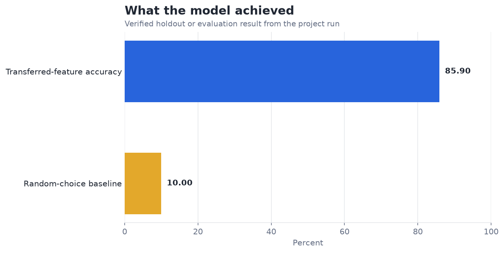
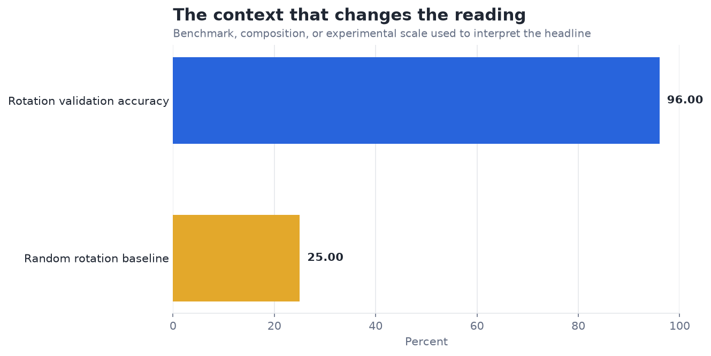

# Self-Supervised Pretraining on Images — Analysis Report

**Author:** Edward Ocran  
**Project:** 25  
**Validation status:** Reproduced locally from the project dataset and code

## Executive Summary

- The rotation-prediction CNN reaches 96.0% validation accuracy, and its transferred encoder supports 85.90% digit accuracy using 800 labels.
- The result shows useful label efficiency: the encoder learned from a label-free rotation task, then supported a ten-class digit model with labels for only one in ten training images. The downstream gap to the fully supervised CNN quantifies the remaining cost of limited labels.
- **Recommended action:** Build a label-budget curve to show accuracy gained per additional labeled image.

## Analytical Question

Can rotation-based self-supervision produce transferable MNIST features with few labels?

## Data and Evaluation Design

The self-supervised stage follows the PDF's rotation task: a CNN predicts 0°, 90°, 180°, or 270° rotations on 4,000 unlabeled MNIST images. The learned 128-unit encoder then produces features for a logistic digit classifier trained with 800 labels and evaluated on 2,000 held-out images.

## Results

| Measure | Result |
|---|---:|
| Images | 10,000 |
| Rotation validation accuracy | 96.00% |
| Labeled digit-training images | 800 |
| Digit holdout accuracy | 85.90% |

## Visual Evidence

## What the Evidence Says

The result shows useful label efficiency: the encoder learned from a label-free rotation task, then supported a ten-class digit model with labels for only one in ten training images. The downstream gap to the fully supervised CNN quantifies the remaining cost of limited labels.

## Risks and Limitations

Rotation prediction is a useful pretext task but does not guarantee that every learned feature transfers to digit identity. The downstream comparison should use matched label budgets and repeated seeds.

## Recommendations

1. Build a label-budget curve to show accuracy gained per additional labeled image.
2. Build a label-budget curve and compare the transferred encoder with a randomly initialized encoder under identical downstream training.

## Reproducibility Notes

- Run `python main.py --json` from this project folder to reproduce the headline metrics.
- Dataset acquisition and provenance are documented in `DATASET.md` where an external dataset is used.
- Rebuild these figures from the repository root with `python tools/build_analysis_reports.py`.
- Charts are stored as regular PNG files so they render directly in GitHub Markdown.
