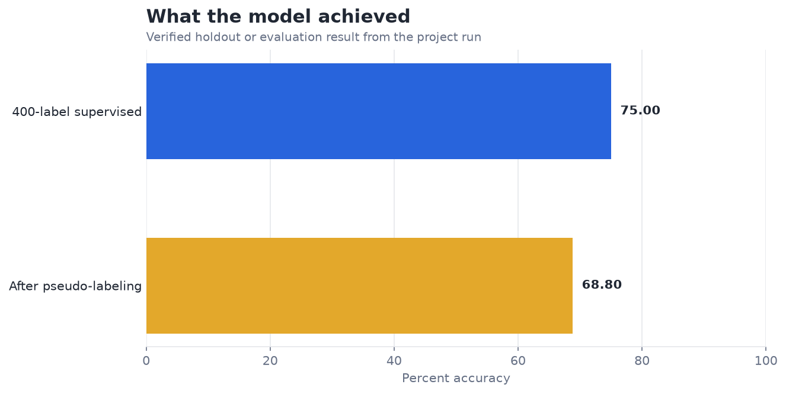
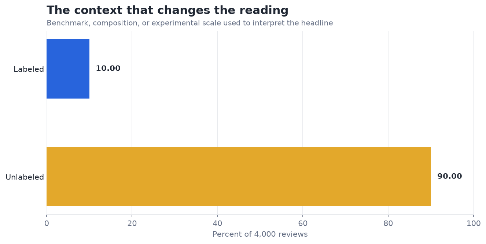

# Semi-Supervised Learning for Document Labeling — Analysis Report

**Author:** Edward Ocran  
**Project:** 26  
**Validation status:** Reproduced locally from the project dataset and code

## Executive Summary

- The 400-label supervised baseline reaches 75.0% accuracy; adding 200 high-confidence pseudo-labels lowers test accuracy to 68.8%.
- Self-training amplifies early mistakes in this run. The negative 6.2-point movement is the key finding: confidence alone did not guarantee label quality, so the pseudo-label acceptance rule needs calibration or human review.
- **Recommended action:** Keep the supervised model as the current benchmark and audit pseudo-label precision before another self-training round.

## Analytical Question

Does high-confidence pseudo-labeling improve on a 400-label sentiment baseline?

## Data and Evaluation Design

The project uses 5,000 IMDb reviews. TF-IDF features are fitted on a 4,000-review training pool, of which 400 receive human labels. A logistic regression creates pseudo-labels for the highest-confidence unlabeled reviews and is retrained with those additions. The untouched final 1,000 reviews provide the test set.

## Results

| Measure | Result |
|---|---:|
| Reviews | 5,000 |
| Human-labeled training records | 400 |
| Pseudo-labeled additions | 200 |
| Supervised baseline accuracy | 75.00% |
| Self-training accuracy | 68.80% |

## Visual Evidence

## What the Evidence Says

Self-training amplifies early mistakes in this run. The negative 6.2-point movement is the key finding: confidence alone did not guarantee label quality, so the pseudo-label acceptance rule needs calibration or human review.

## Risks and Limitations

No unlabeled review crossed the initial 0.90 probability threshold, so the implementation used a documented top-200 confidence fallback. The lower final accuracy indicates that those pseudo-labels were not reliable enough.

## Recommendations

1. Keep the supervised model as the current benchmark and audit pseudo-label precision before another self-training round.
2. Measure pseudo-label precision on an audited sample, calibrate confidence, and stop self-training when held-out performance does not improve.

## Reproducibility Notes

- Run `python main.py --json` from this project folder to reproduce the headline metrics.
- Dataset acquisition and provenance are documented in `DATASET.md` where an external dataset is used.
- The committed figures correspond to the measured results documented in this report.
- Charts are stored as regular PNG files so they render directly in GitHub Markdown.
