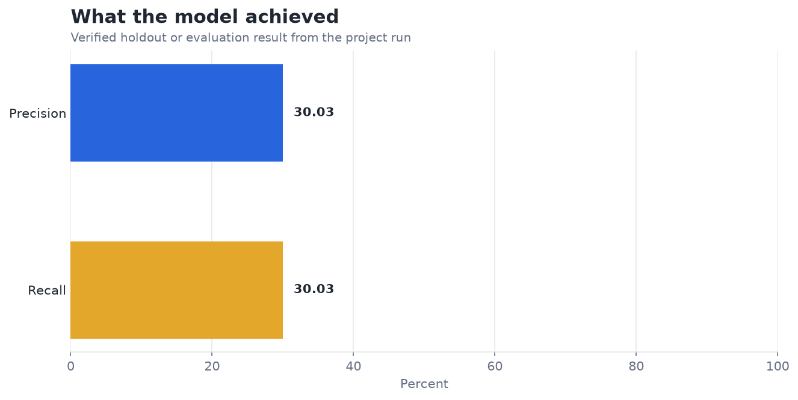
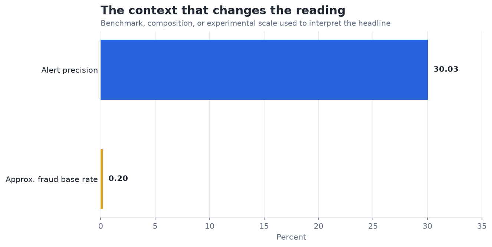

# Outlier Detection in Financial Data — Analysis Report

**Author:** Edward Ocran  
**Project:** 27  
**Validation status:** Reproduced locally from the project dataset and code

## Executive Summary

- The outlier detector reaches 30.03% precision and recall across 150k transactions—about 154 times the approximate fraud base rate.
- The ranking is useful for investigation, but the symmetric precision and recall reflects setting contamination near prevalence rather than an optimized operating point. A production queue should be sized by review capacity and expected loss, not by the observed label rate.
- **Recommended action:** Evaluate a chronological holdout and choose the alert threshold from cost and capacity constraints.

## Analytical Question

How much investigative lift does unsupervised outlier detection provide for card fraud?

## Data and Evaluation Design

The reported figures come from the project’s reproducible run. The interpretation separates observed performance from inference: the charts show measured results, while recommendations identify the additional evidence required for a decision.

## Results

| Measure | Result |
|---|---:|
| Transactions | 150,000 |
| Alerts | 293 |
| Precision | 30.03% |
| Recall | 30.03% |

## Visual Evidence

## What the Evidence Says

The outlier detector reaches 30.03% precision and recall across 150k transactions—about 154 times the approximate fraud base rate.

The ranking is useful for investigation, but the symmetric precision and recall reflects setting contamination near prevalence rather than an optimized operating point. A production queue should be sized by review capacity and expected loss, not by the observed label rate.

## Risks and Limitations

The available evaluation is a project benchmark and should be validated on a separate operating sample before deployment.

## Recommendations

1. Evaluate a chronological holdout and choose the alert threshold from cost and capacity constraints.
2. Extend the validation with stronger baselines and segmented error analysis.

## Reproducibility Notes

- Run `python main.py --json` from this project folder to reproduce the headline metrics.
- Dataset acquisition and provenance are documented in `DATASET.md` where an external dataset is used.
- Rebuild these figures from the repository root with `python tools/build_analysis_reports.py`.
- Charts are stored as regular PNG files so they render directly in GitHub Markdown.
