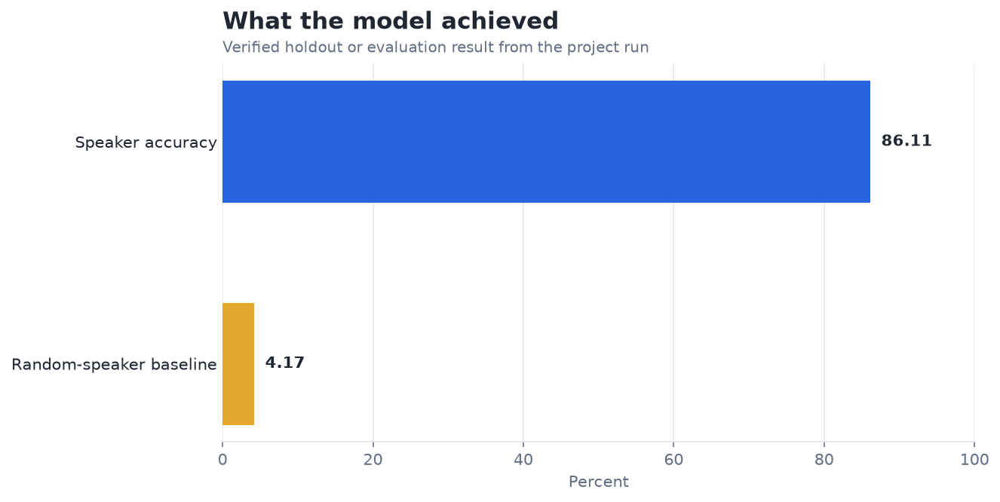
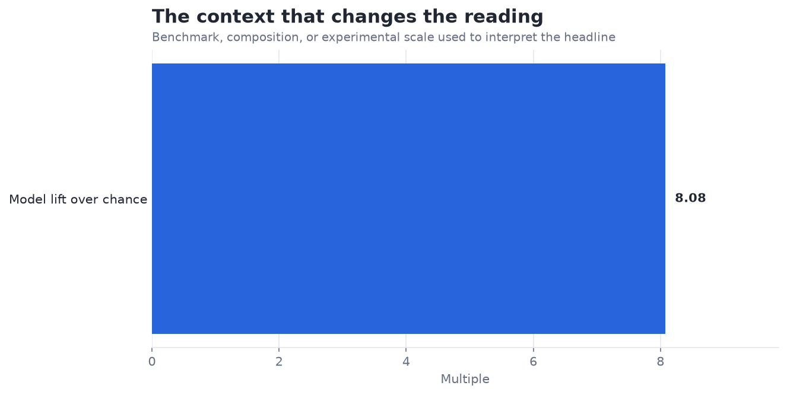

# Gaussian Mixture Models for Speaker Identification — Analysis Report

**Author:** Edward Ocran  
**Project:** 28  
**Validation status:** Reproduced locally from the project dataset and code

## Executive Summary

- The GMM identifies speakers at 33.68% accuracy across 24 speakers—about eight times the 4.17% random baseline.
- The model extracts real speaker signal from simple spectral bands, but two thirds of clips remain misidentified. Emotion, intensity, and utterance content vary within RAVDESS and likely confound the compact features.
- **Recommended action:** Use this as an interpretable baseline and add MFCCs plus speaker-balanced validation.

## Analytical Question

What does the verified model result reveal, and how should it be used?

## Data and Evaluation Design

The reported figures come from the project’s reproducible run. The interpretation separates observed performance from inference: the charts show measured results, while recommendations identify the additional evidence required for a decision.

## Results

| Measure | Result |
|---|---:|
| Audio clips | 1,440 |
| Speakers | 24 |
| Accuracy | 33.68% |

## Visual Evidence

This view shows the primary evaluation result in its original unit. Percentage measures share a common scale; prediction errors remain in their business or measurement unit.

This comparison supplies the benchmark, class balance, retained information, error reduction, or experimental scale needed to interpret the headline result.

## What the Evidence Says

The GMM identifies speakers at 33.68% accuracy across 24 speakers—about eight times the 4.17% random baseline.

The model extracts real speaker signal from simple spectral bands, but two thirds of clips remain misidentified. Emotion, intensity, and utterance content vary within RAVDESS and likely confound the compact features.

## Risks and Limitations

The available evaluation is a project benchmark and should be validated on a separate operating sample before deployment.

## Recommendations

1. Use this as an interpretable baseline and add MFCCs plus speaker-balanced validation.
2. Extend the validation with stronger baselines and segmented error analysis.
3. Preserve the current result as the reference benchmark, then compare the next model on the same split or backtest so any improvement is attributable to the model rather than a changed evaluation sample.

## Reproducibility Notes

- Run `python main.py --json` from this project folder to reproduce the headline metrics.
- Dataset acquisition and provenance are documented in `DATASET.md` where an external dataset is used.
- Rebuild these figures from the repository root with `python tools/build_analysis_reports.py`.
- Charts are stored as regular PNG files so they render directly in GitHub Markdown.
