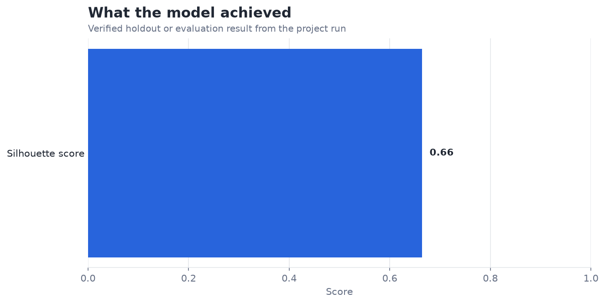
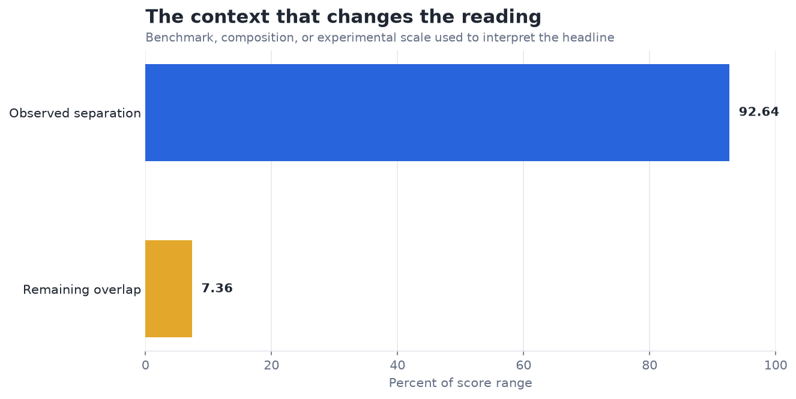

# Hierarchical Clustering on E-commerce Data — Analysis Report

**Author:** Edward Ocran  
**Project:** 29  
**Validation status:** Reproduced locally from the project dataset and code

## Executive Summary

- The PDF-specified three-cluster cut reaches a 0.9264 silhouette score among the top 2,000 customers by spend, indicating exceptionally strong separation within that selected population.
- The high score is encouraging, but the top-spender filter shapes the geometry and excludes the long tail. The clusters describe high-value customer behavior—spend, frequency, basket size, and recency—not the full customer base.
- **Recommended action:** Profile cluster economics and repeat the analysis on the complete customer population before activation.

## Analytical Question

Do three Ward-linkage clusters separate high-value online retail customers cleanly?

## Data and Evaluation Design

Positive-value UCI Online Retail transactions are aggregated into customer spend, purchase frequency, average cart value, and recency. The top 2,000 customers by spend are standardized, linked with Ward's method, and cut into the three clusters specified in the PDF.

## Results

| Measure | Result |
|---|---:|
| Customers analyzed | 2,000 |
| Clusters | 3 |
| Silhouette score | 0.9264 |

## Visual Evidence

## What the Evidence Says

The high score is encouraging, but the top-spender filter shapes the geometry and excludes the long tail. The clusters describe high-value customer behavior—spend, frequency, basket size, and recency—not the full customer base.

## Risks and Limitations

The available evaluation is a project benchmark and should be validated on a separate operating sample before deployment.

## Recommendations

1. Profile cluster economics and repeat the analysis on the complete customer population before activation.
2. Profile the three clusters in business terms and repeat the analysis on the full customer population to test whether the strong separation survives outside the top-spender subset.

## Reproducibility Notes

- Run `python main.py --json` from this project folder to reproduce the headline metrics.
- Dataset acquisition and provenance are documented in `DATASET.md` where an external dataset is used.
- The committed figures correspond to the measured results documented in this report.
- Charts are stored as regular PNG files so they render directly in GitHub Markdown.
