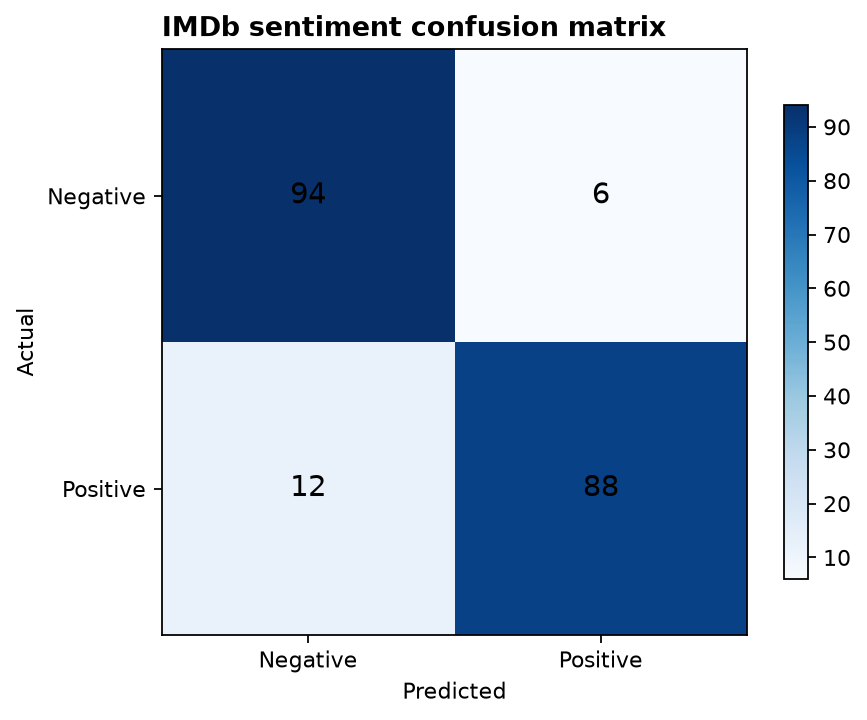
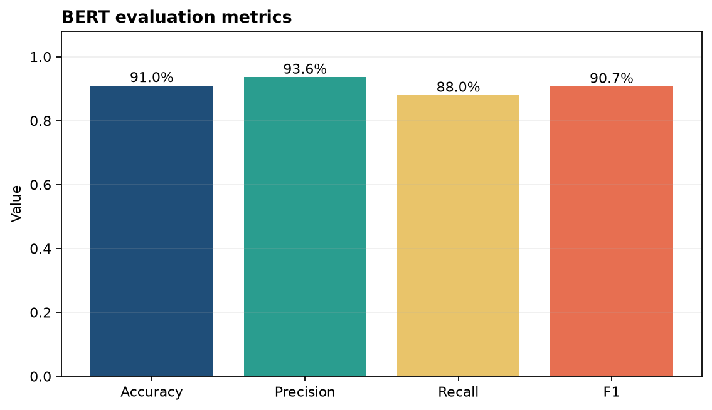

# Analysis Report

**Author:** Edward Ocran
**Model:** DistilBERT fine-tuned on SST-2
**Evaluation data:** Balanced 200-review sample from the Kaggle IMDb Dataset of 50K Movie Reviews

## Executive finding

The pretrained classifier separated positive and negative reviews with **91.0% accuracy**. Precision on positive reviews reached **93.62%**, while recall was lower at **88.0%**. The model is therefore more conservative about declaring a review positive than it is permissive: only six negative reviews were incorrectly promoted to positive, compared with twelve positive reviews incorrectly marked negative.

## Method

The run drew 100 positive and 100 negative reviews using a fixed random seed. Reviews were passed to `distilbert-base-uncased-finetuned-sst-2-english` with truncation at the model limit. Predictions were compared with the IMDb labels and summarized with accuracy, positive-class precision, recall, F1, and a confusion matrix.

## Interpretation

The **90.72% F1 score** confirms that the result is not being carried by one class. The most notable operating characteristic is the six-point precision–recall gap. In a customer-feedback workflow, that behavior would produce a relatively clean positive queue, but some genuinely positive comments would be routed into the negative queue. That matters if the output is used for escalation or reputation monitoring.

The error balance also suggests a practical review policy. Negative predictions near the decision boundary deserve manual inspection because false negatives were twice as common as false positives. The current result is suitable for screening and trend aggregation; decisions affecting an individual customer should retain a human review step.

## Reproducibility

Run `python download_data.py` to resolve the Kaggle dataset, then `python main.py`. The sampled rows, model identifier, truncation behavior, and random seed are fixed in code. The dataset remains in KaggleHub's local cache and is not redistributed here.
