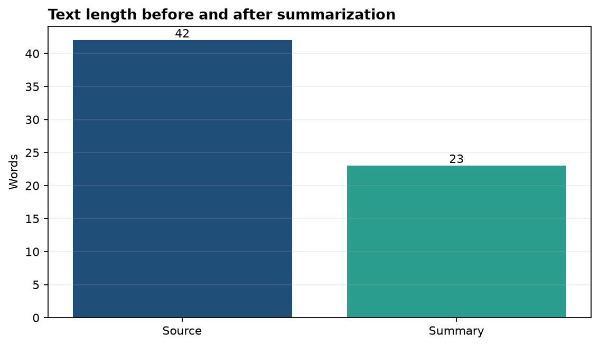
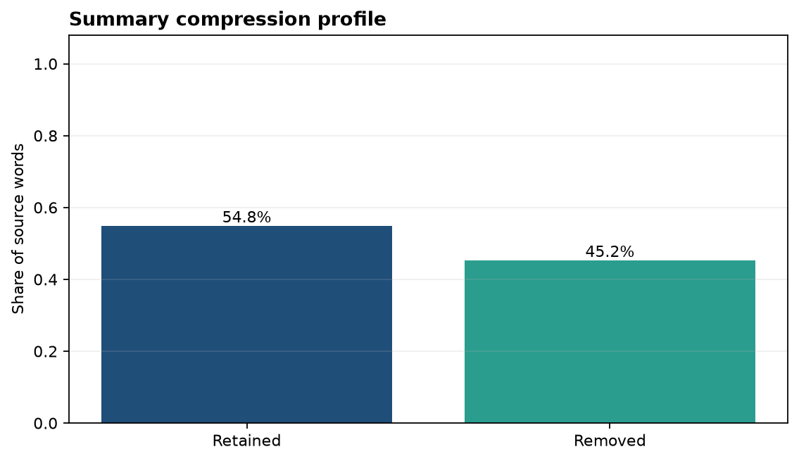

# Analysis Report

**Author:** Edward Ocran
**Model:** `google-t5/t5-small`
**Task:** Abstractive summarization

## Executive finding

The summarizer reduced a 42-word source passage to 23 words, retaining **54.8%** of the original length. The output preserved the passage's central mechanism—combining restored wetlands, barriers, and drainage—and retained the two main benefits: lower surge risk and protected public and ecological value.

## Method

A short policy-style passage about urban flood defenses was passed to T5 with deterministic decoding. The review considered compression, factual coverage, focus, and whether the summary introduced claims absent from the source. Word count is used as a transparent compression measure rather than as a quality score on its own.

## Interpretation

The model made a sensible editorial choice: it removed the setup about unpredictable rainfall and the downstream funding decision, then concentrated on the intervention and its effects. This produces a useful briefing sentence for someone who needs the operational message quickly.

The compression profile is moderate rather than aggressive. That is appropriate for a short source because excessive compression would likely erase either the engineering mix or the benefit statement. The generated wording remained grounded in the source and did not add locations, costs, dates, or performance claims.

For production use, summary quality should be checked across longer documents with human ratings for factual consistency and coverage. The present run establishes that the pipeline executes the T5 model, returns a substantially shorter passage, and preserves the source's main argument.

## Reproducibility

Install the project requirements and run `python main.py`. The source passage and decoding controls are stored in `main.py`; the JSON output includes the source length, summary length, compression ratio, and generated summary.
