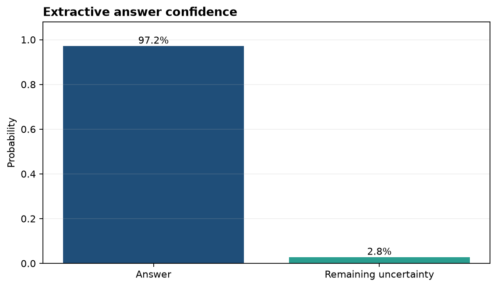
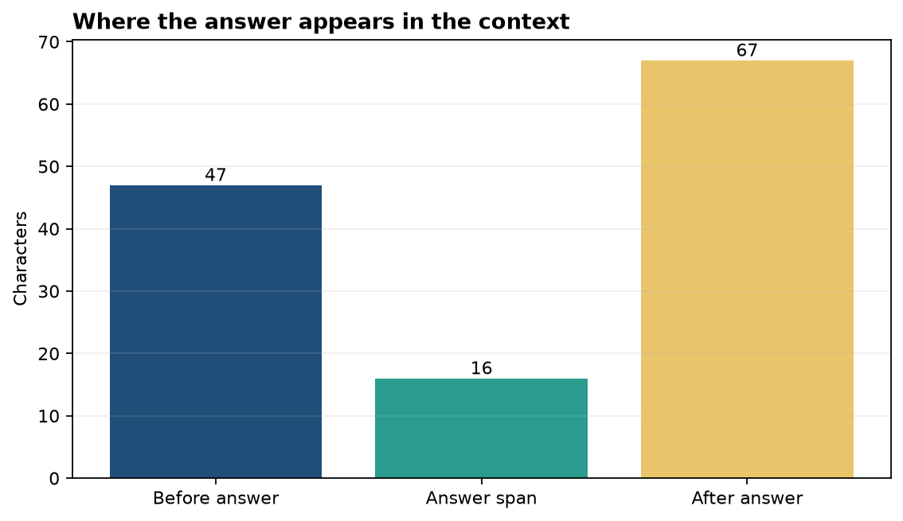

# Analysis Report

**Author:** Edward Ocran
**Model:** DistilBERT fine-tuned on SQuAD
**Task:** Extractive question answering

## Executive finding

For the question “When was the James Webb Space Telescope launched?”, the reader extracted **25 December 2021** with **97.2% confidence**. The answer exactly matches the relevant span in the supplied context and includes the full day, month, and year.

## Method

The project uses `distilbert-base-cased-distilled-squad` through the Transformers question-answering pipeline. The model receives a question and a bounded context, then returns the answer text, confidence, and character offsets. The validation checks both semantic correctness and whether the offsets reproduce the returned text.

## Interpretation

The score indicates a decisive match rather than a marginal extraction. The answer begins at character 47 and spans 16 characters, leaving enough surrounding text on both sides for a user interface to highlight the evidence in context.

This evidence-first structure is an important property of extractive QA. The system does not invent a free-form response; it points to the exact source text used. That makes the result auditable and suitable for document search, policy lookup, or knowledge-base support where traceability matters.

The current demonstration uses a clean factual paragraph with one unambiguous date. Broader deployment should evaluate paraphrased questions, competing dates, unanswered questions, and longer contexts. A practical confidence threshold can then route uncertain cases to search results rather than presenting an unsupported answer.

## Reproducibility

Run `python main.py` to execute the pretrained reader. The context, question, model identifier, answer, score, and offsets are all emitted in JSON, while the unit test checks the expected answer and confidence behavior.
