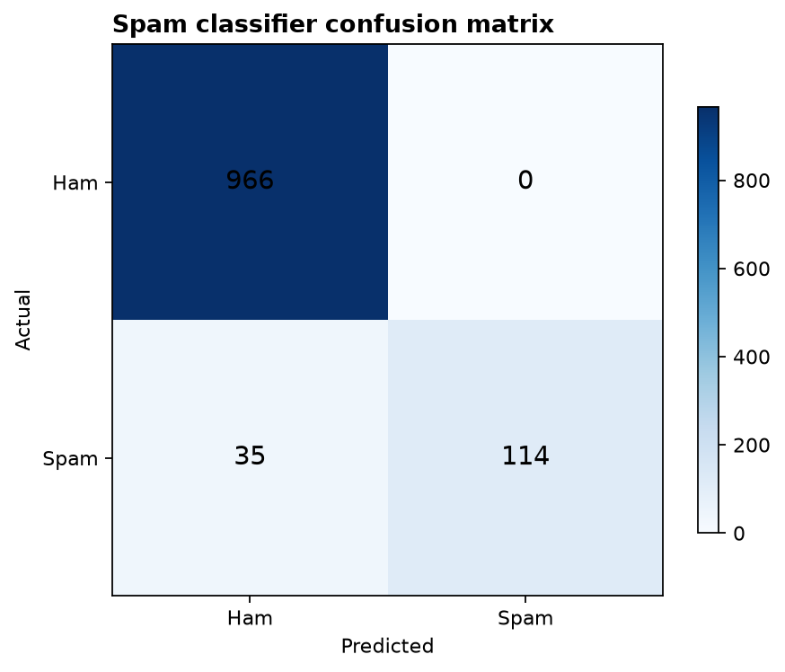
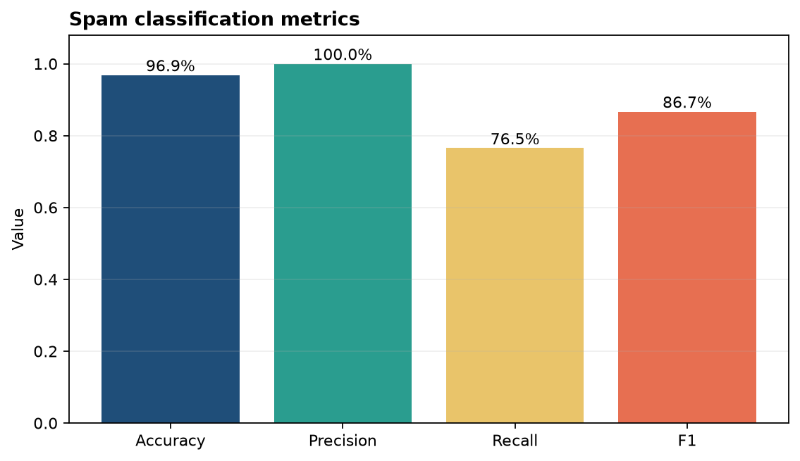

# Analysis Report

**Author:** Edward Ocran
**Dataset:** Kaggle SMS Spam Collection, 5,572 labelled messages
**Model:** TF-IDF with Multinomial Naive Bayes

## Executive finding

The classifier achieved **96.86% accuracy** on a stratified holdout set. More importantly, it produced **zero false positives**: none of the 966 legitimate messages in the test set was incorrectly blocked. Spam recall was **76.51%**, so the principal residual risk is missed spam rather than disruption of legitimate communication.

## Method

Messages were split 80/20 with label stratification and a fixed random seed. Text was converted to TF-IDF features with English stop-word removal, then classified with Multinomial Naive Bayes. The evaluation reports accuracy and spam-class precision, recall, F1, and confusion counts.

## Interpretation

Perfect spam precision is operationally attractive where false alarms are costly. Every message flagged as spam in this test was truly spam. The trade-off is visible in the 35 spam messages classified as ham, which pulls recall below the other headline metrics.

The **86.69% spam F1 score** provides a more balanced view than accuracy because spam is the minority class. A production filter could improve capture by tuning the decision threshold, adding character n-grams, or comparing logistic regression and linear SVM baselines. Any adjustment should protect the current zero-false-positive result unless the business is willing to quarantine some legitimate messages.

The custom prize-message example was classified as spam, confirming that the trained pipeline can be used for new text after evaluation.

## Reproducibility

Run `python download_data.py` to resolve the Kaggle source and `python main.py` to train and evaluate. The raw dataset stays in KaggleHub's cache. The split, feature construction, model, label order, and reported metrics are fixed and inspectable.
