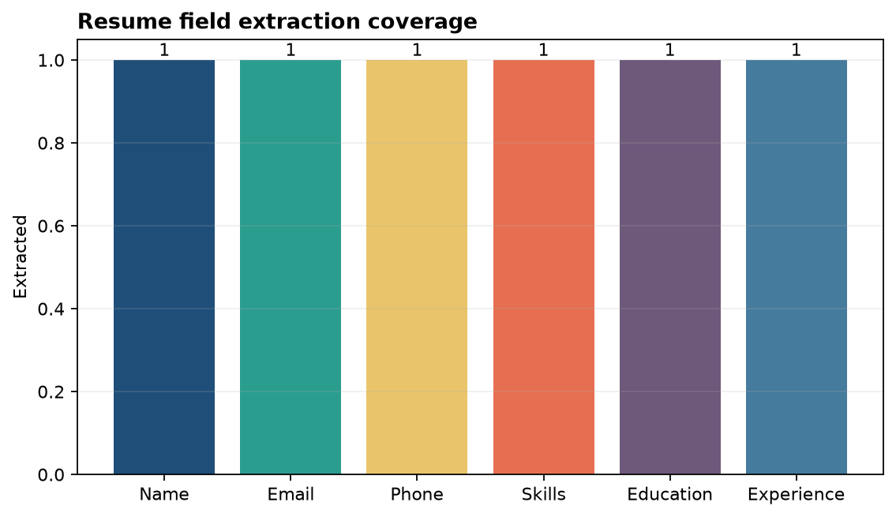
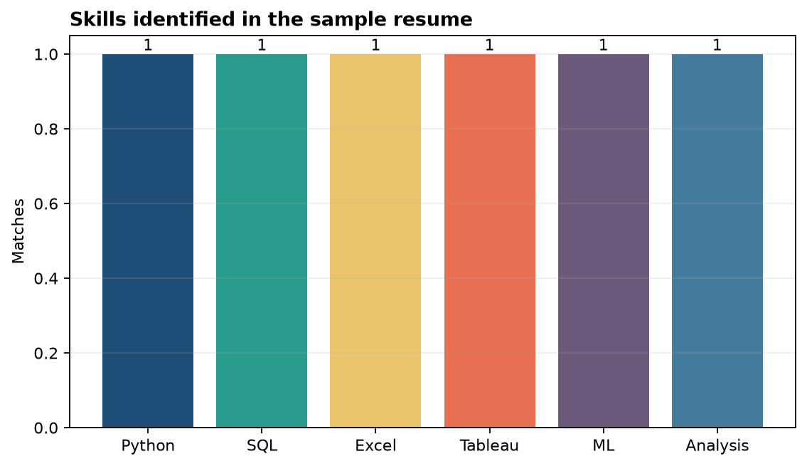

# Analysis Report

**Author:** Edward Ocran
**Input:** Fictional sample resume supplied with the project
**Methods:** pdfplumber, regular expressions, spaCy, and section rules

## Executive finding

The parser populated all six target fields: name, email, phone, skills, education, and experience. It identified six explicit skills—Python, SQL, Excel, Tableau, machine learning, and data analysis—without treating unrelated narrative text as a skill.

## Method

TXT files are read directly; PDF files are converted to text with pdfplumber. Email and telephone values use transparent regular expressions. The candidate name comes from spaCy's PERSON entities. Skills are matched against a documented vocabulary, while education and experience are captured between recognized section headings.

## Interpretation

The extraction result is useful because it preserves structure rather than returning an undifferentiated word list. Contact fields can feed an applicant record, the skill array supports filtering, and the education and experience strings retain enough context for human review.

The rule-based components are deliberately inspectable. If a phone number or skill is missed, the responsible expression or vocabulary can be tested and changed without retraining a model. spaCy contributes where linguistic context matters most: identifying the person's name.

Resume layouts vary widely, especially multi-column PDFs and documents with custom headings. A practical next step is a labelled test set covering several layouts, with field-level precision and recall. That would distinguish text-extraction failures from entity or section-detection failures and guide targeted improvements.

## Reproducibility

Run `python main.py` for the supplied sample or pass a TXT/PDF path as the positional argument. The sample is fictional and contains no personal data. The JSON output reports every extracted field and the number of populated fields and skills.
