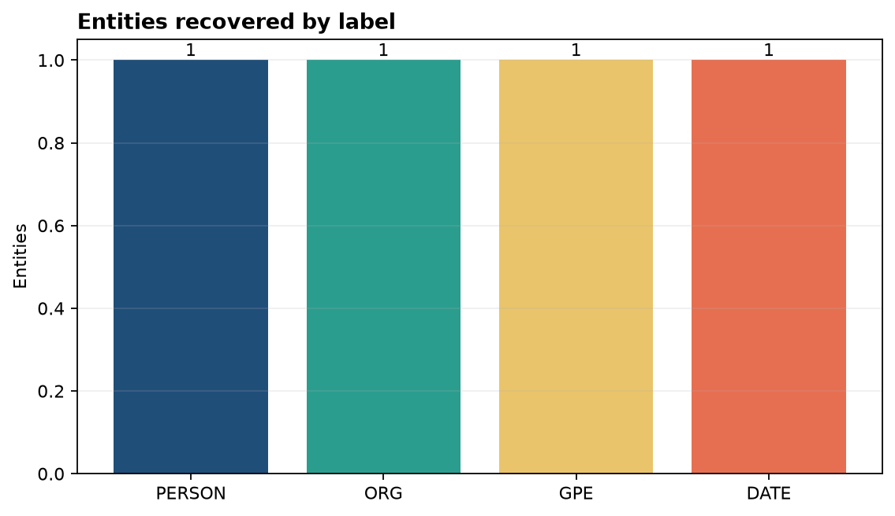
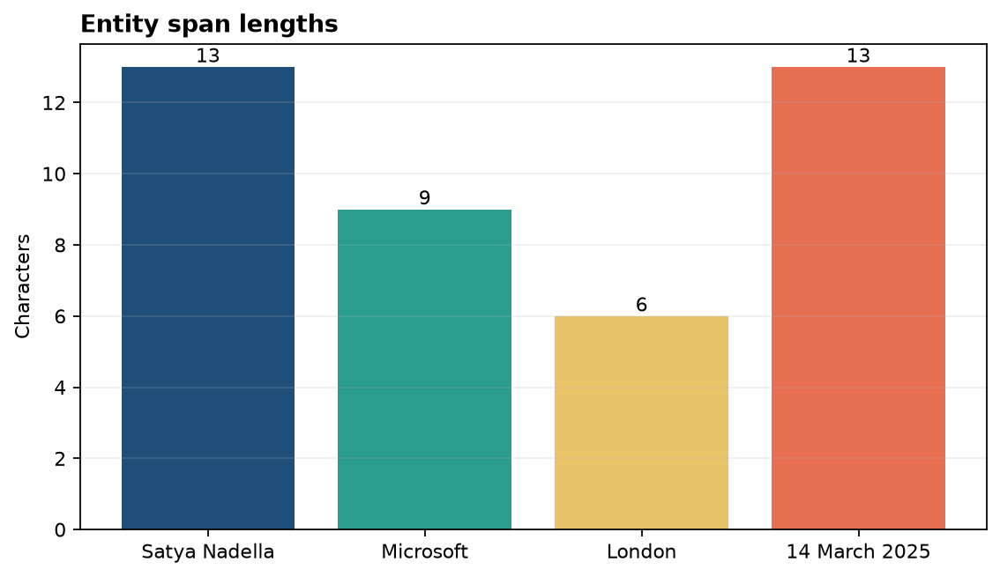

# Analysis Report

**Author:** Edward Ocran
**Model:** spaCy `en_core_web_sm`
**Task:** Named entity recognition

## Executive finding

The pipeline recovered the four entities embedded in the test sentence: **Satya Nadella** as PERSON, **Microsoft** as ORG, **London** as GPE, and **14 March 2025** as DATE. Each target category was represented once and the character offsets aligned with the original sentence.

## Method

The text is processed with spaCy's English statistical pipeline. The project returns the entity text, type, start offset, and end offset rather than only printing highlighted text. This structure supports downstream filtering, annotation, and database loading.

## Interpretation

The result shows that the model distinguishes categories that often appear together in business writing. Microsoft is correctly treated as an organization rather than a place, while London is classified as a geopolitical entity. The complete date span is preserved, which is preferable to splitting the day, month, and year.

Offsets make the output verifiable. A consuming application can reconstruct each substring from the source and highlight it without fuzzy matching. The span-length chart also confirms that multi-token entities such as the person's name and date remain intact.

This is a functional validation on a controlled sentence, not a corpus-level accuracy claim. A deployment evaluation should sample text from the intended domain, because abbreviations, uncommon names, and industry terminology can shift the error profile. The same output schema can support that evaluation without changing the application interface.

## Reproducibility

Install spaCy and the `en_core_web_sm` model, then run `python main.py`. The text, labels, and offsets are returned in JSON; the unit test checks the four expected entity types.
