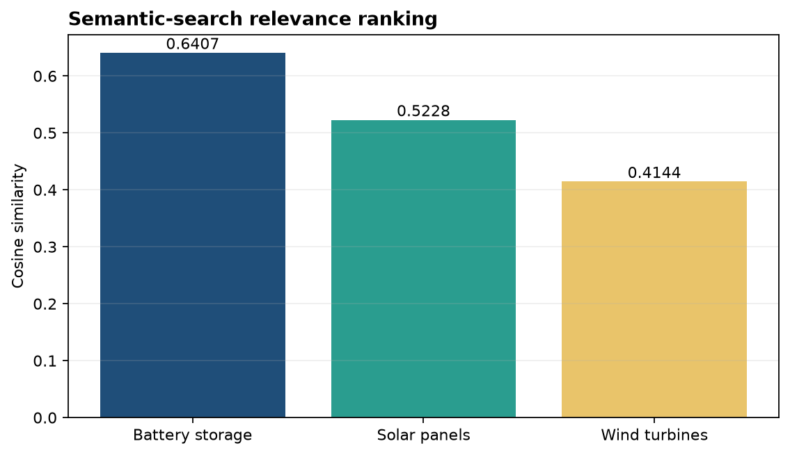
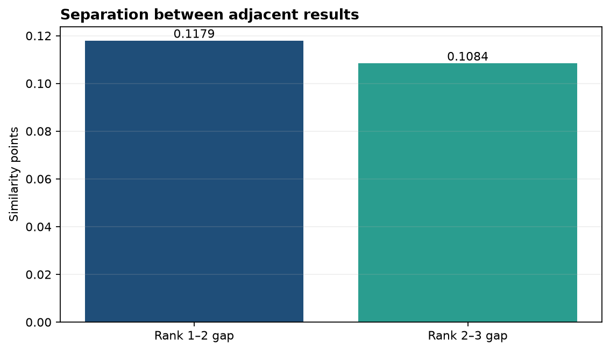

# Analysis Report

**Author:** Edward Ocran
**Model:** `sentence-transformers/all-MiniLM-L6-v2`
**Task:** Semantic document retrieval

## Executive finding

For the query “How can excess renewable power be saved for later?”, the system ranked the battery-storage document first with a cosine similarity of **0.6407**. Solar panels and wind turbines followed at 0.5228 and 0.4144. The ranking captures meaning rather than requiring the query and document to share the same wording.

## Method

Five short documents were encoded into normalized sentence embeddings. The query was encoded in the same vector space, and documents were ranked by cosine similarity. The project returns the top three texts, their ranks, and scores.

## Interpretation

The first result directly addresses storing renewable supply for later use. The query does not contain the exact phrase “battery storage,” so a lexical-only search could struggle; the embedding model correctly connects the concepts.

The gap between rank one and rank two is **0.1179**, slightly larger than the 0.1084 gap between ranks two and three. That separation supports a confident first result while still showing that generation technologies remain semantically related to the renewable-energy query.

A score should be interpreted relative to the candidate collection rather than as a universal probability. In a larger application, a minimum relevance threshold and a “no strong result” path would prevent weak matches from being presented as answers. Retrieval quality should also be tested with multiple queries and known-relevant documents using recall@k or mean reciprocal rank.

## Reproducibility

Run `python main.py` after installing the requirements. The fixed corpus, query, model name, normalized embeddings, ranking, and cosine scores are present in the code and JSON output.
