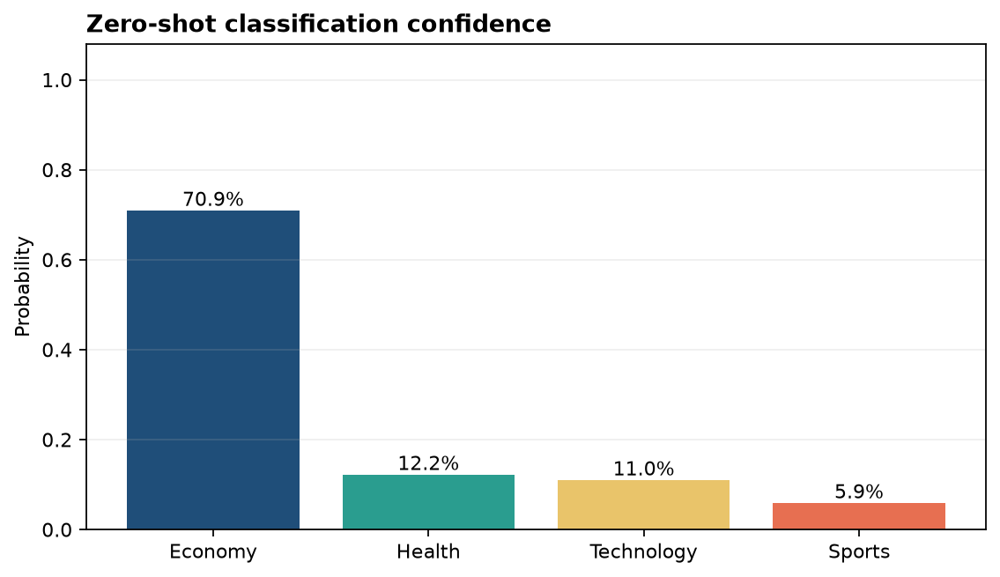
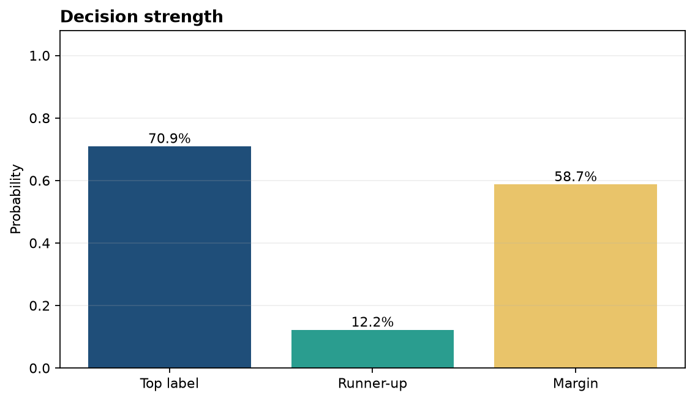

# Analysis Report

**Author:** Edward Ocran
**Model:** `facebook/bart-large-mnli`
**Task:** Zero-shot topic classification

## Executive finding

The sentence about a central bank holding interest rates steady was classified as **economy** with **70.92% confidence**. Health, technology, and sports received 12.20%, 10.99%, and 5.89%. The top label exceeded the runner-up by **58.72 percentage points**, making the decision clear despite no task-specific training examples.

## Method

The text and four candidate labels were passed to the BART model fine-tuned on natural-language inference. The pipeline reformulates each label as a hypothesis and ranks the labels by entailment. Multi-label mode was disabled, so the returned scores form a single-label decision.

## Interpretation

The economic label is supported by three linked cues: central bank, interest rates, and inflation. The model's distribution reflects that coherence rather than reacting to a single keyword. The runner-up scores remain low and tightly grouped.

The margin is useful for routing. A high-margin result can be accepted automatically, while a close result can be reviewed or assigned more specific candidate labels. Label wording matters in zero-shot systems; “monetary policy” might produce a different and potentially more precise ranking than the broader “economy.”

For operational use, candidate labels should be mutually understandable and validated on a labelled sample from the target domain. This run demonstrates the intended PDF workflow and verifies that the actual BART-MNLI model produces an interpretable ranking.

## Reproducibility

Install the project requirements and run `python main.py`. The sentence, candidate labels, model identifier, ordered scores, and top-label confidence are returned in JSON.
