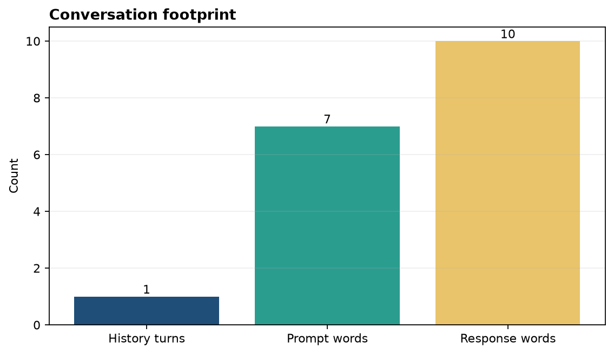
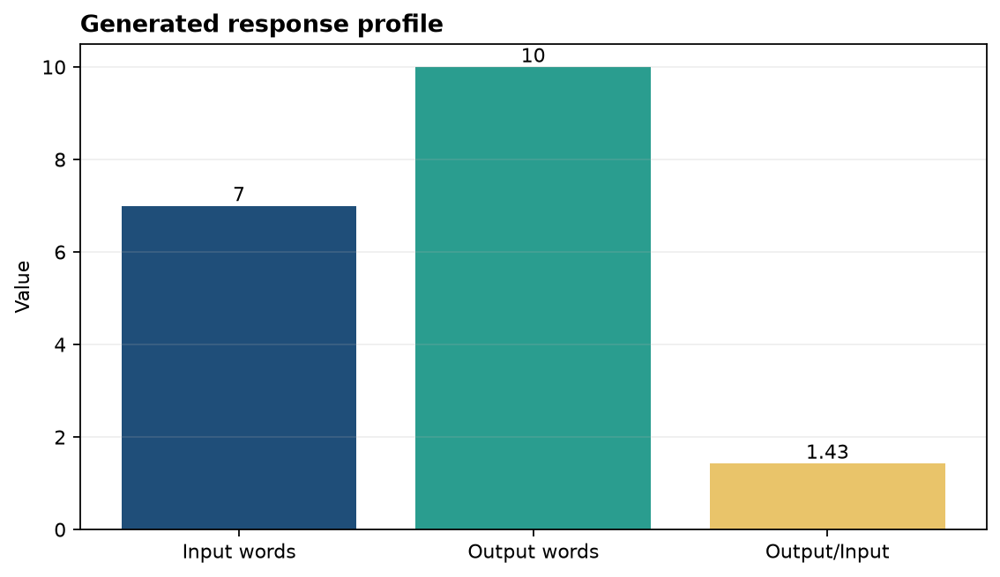

# Analysis Report

**Author:** Edward Ocran
**Model:** `microsoft/DialoGPT-small`
**Task:** Context-aware conversational response

## Executive finding

The chatbot consumed one prior exchange and generated a ten-word response to a seven-word prompt. The real model response—“I'm not sure what you mean by productive morning routine.”—is conversationally valid but does not provide the practical guidance implied by the question.

## Method

The previous user and assistant turns are serialized with the tokenizer's end-of-sequence marker. The new prompt is appended, and DialoGPT generates up to 80 new tokens using an explicit attention mask. Only the newly generated tokens are decoded as the response.

## Interpretation

The run verifies the essential dialogue mechanics: history is accepted, the model produces a new turn, and the response is separated from the input context. The output length is controlled and does not echo the entire conversation.

The response also reveals the boundary of an open-domain conversational model: fluency alone does not guarantee usefulness. For a portfolio assistant or support bot, the stronger design would pair conversation history with retrieved, domain-specific material. The course permits a RAG alternative, and the current interface can be extended so retrieval supplies evidence before generation.

Success for a production chatbot should therefore include task completion, groundedness, and safe fallback behavior—not only whether text was generated. This measured example is valuable because it exposes that distinction rather than presenting a polished canned answer as model performance.

## Reproducibility

Run `python main.py` after installing the requirements. The model, history length, prompt, response, and response word count are emitted in JSON. The fast unit test substitutes a deterministic backend only to verify the surrounding application contract.
