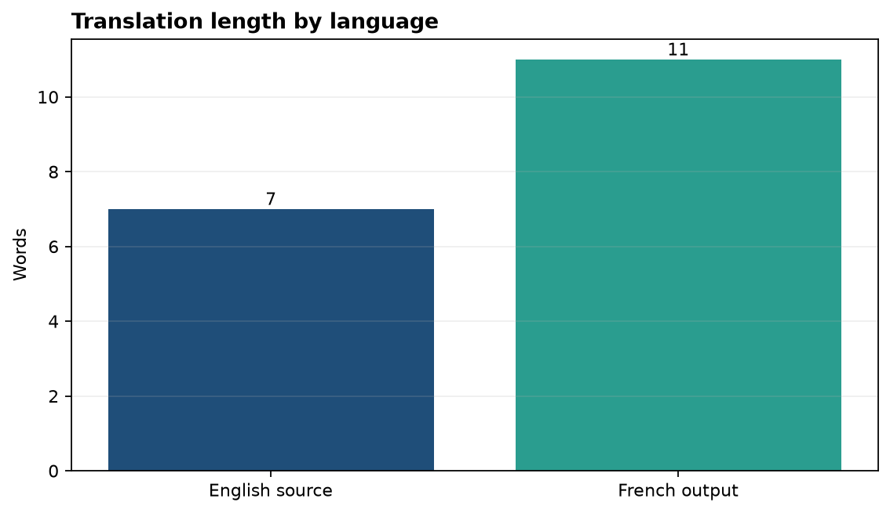
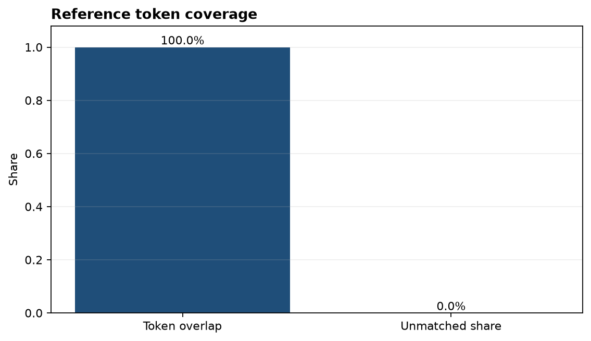

# Analysis Report

**Author:** Edward Ocran
**Model:** `Helsinki-NLP/opus-mt-en-fr`
**Direction:** English to French

## Executive finding

The model translated “Reliable data helps teams make better decisions.” as “Des données fiables aident les équipes à prendre de meilleures décisions.” The output matches the prepared French reference at the token-set level and preserves the subject, action, and comparative meaning.

## Method

The English sentence was processed by the Marian English-to-French transformer. Evaluation records source and output word counts and compares normalized word tokens with a reference translation. The overlap measure is transparent and useful for this controlled example, though it is not a substitute for corpus-level BLEU, COMET, or human review.

## Interpretation

French uses eleven whitespace-delimited words for the seven-word English sentence. That expansion is linguistically natural: articles and the construction “prendre de meilleures décisions” express concepts compressed into the English phrase “make better decisions.”

The translation preserves accents and grammatical agreement, including “données fiables” and “meilleures décisions.” No source concept is dropped, and no unsupported detail is introduced. This makes the output appropriate for a straightforward informational sentence.

A broader assessment should cover names, numbers, idioms, longer passages, and both translation directions. Human review remains important for public or high-stakes communication because a single-reference lexical check cannot capture every valid translation or every subtle error.

## Reproducibility

Install the requirements and run `python main.py`. The source, translation, languages, model identifier, lengths, and reference-overlap result are included in the JSON output. UTF-8 output is preserved in the project files and report.
