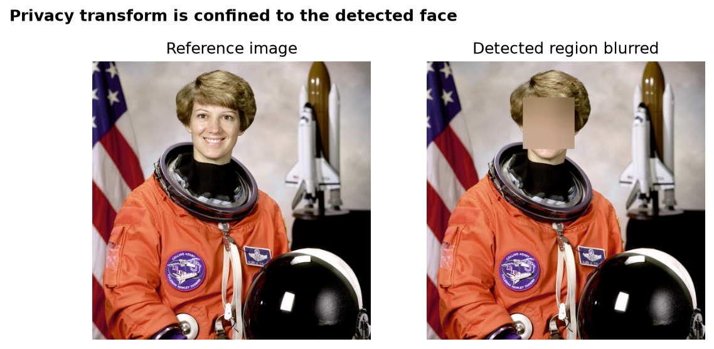
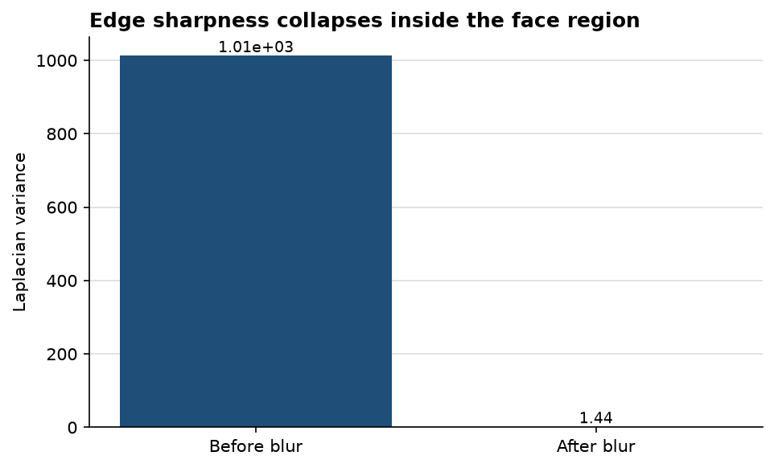

# Face-specific blur removes identifying detail without discarding the scene

**Author:** Edward Ocran  
**Method:** OpenCV Haar cascade and Gaussian blur  
**Reference input:** `skimage.data.astronaut`

## Executive summary

- The Haar cascade identified one face in the 512 × 512 reference image.
- Within that region, Laplacian variance fell from **1,012.32 to 1.44**, a **99.86% reduction** in measurable edge sharpness.
- The rest of the frame remains untouched, preserving the suit, mission patches, helmet, and background for downstream review.

## What the result shows

The detection lands on the central facial area and the blur is limited to that bounding box. This is the important operational distinction: a full-frame blur would remove context, while a face-only transform protects identity and keeps most of the image analytically useful.

The sharpness comparison confirms that the change is substantive rather than cosmetic. Laplacian variance is not a privacy guarantee, but the drop from 1,012.32 to 1.44 shows that the high-frequency detail needed to distinguish facial features has been almost entirely removed inside the detected region.

## Practical interpretation

This implementation is suitable as a first privacy pass for controlled photographs with a clear, frontal face. The main risk sits upstream: if the cascade does not detect a face, no blur is applied. A production workflow should therefore log detection counts, flag zero-face frames for review, and test profile faces, occlusion, low light, and small subjects before treating the output as de-identified.

## Reproducibility

Run `python main.py`. The processed image is saved to `outputs/blurred_faces.png`; the JSON output records the detected box and sharpness measurements.
