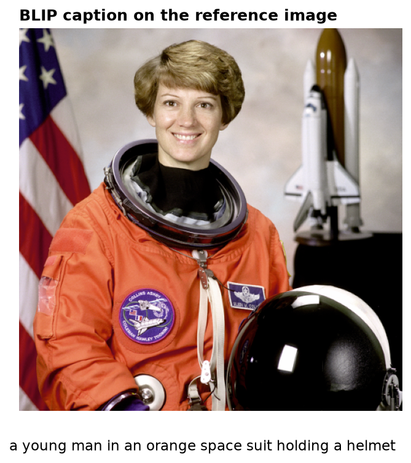
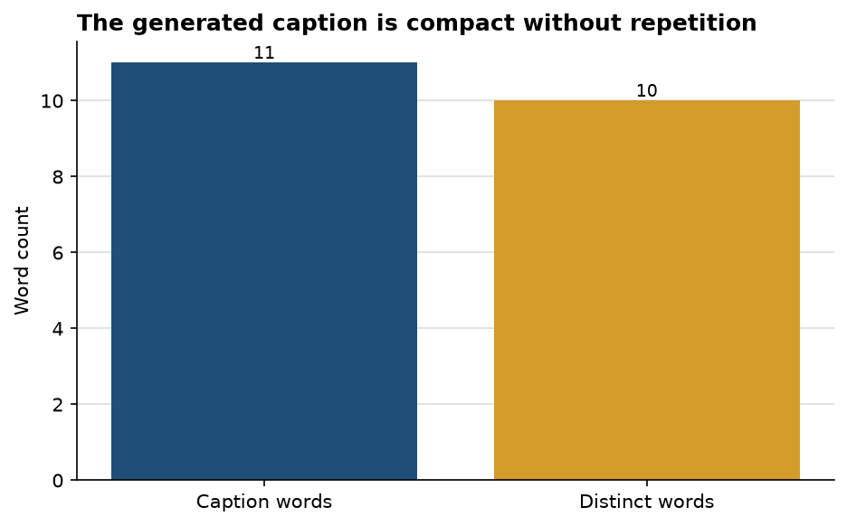

# BLIP captures the scene, but one unsupported attribute changes the meaning

**Author:** Edward Ocran  
**Model:** `Salesforce/blip-image-captioning-base`  
**Reference input:** `skimage.data.astronaut`

## Executive summary

- BLIP produced an 11-word caption: *“a young man in an orange space suit holding a helmet.”*
- The caption correctly identifies the principal subject, orange suit, and helmet.
- The phrase “young man” is not supported by the pixels needed for the task and illustrates why attribute-level review matters even when the overall caption sounds fluent.

## Reading the output

The caption is concise, grammatical, and grounded in the dominant visual evidence. It does not wander into background detail or repeat phrases. Ten of its eleven tokens are distinct, so the output is compact without being mechanically repetitive.

The weakness is semantic rather than linguistic. The model converts uncertain appearance into a specific demographic description. That single choice can affect search, accessibility text, or metadata even though the remaining description is useful. A safer caption for operational use would describe “an astronaut” or “a person in an orange space suit” and avoid inferring gender or age unless those attributes are explicitly required and separately validated.

## Practical interpretation

BLIP is strong enough to draft alt text or searchable image metadata, but it should be treated as a first pass. A simple post-processing policy can remove unsupported person attributes while retaining objects, actions, and visible context. Evaluation should also move beyond word count to a reviewed sample scored for object coverage, factual errors, and harmful attribute inference.

## Reproducibility

Run `python main.py`. The first run downloads the pretrained BLIP processor and model; subsequent runs use the local model cache.
