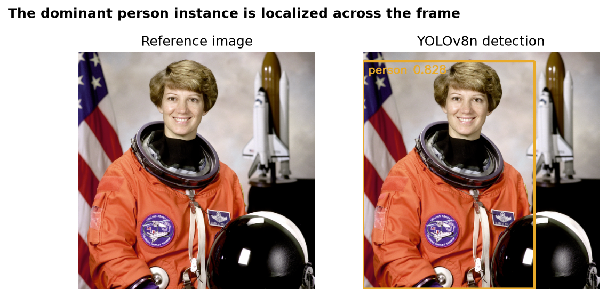
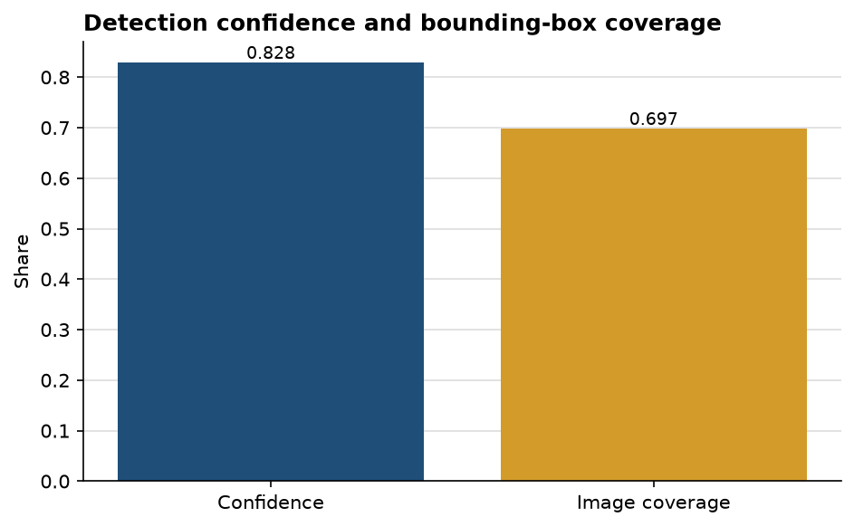

# YOLOv8 finds the dominant person cleanly and leaves secondary objects unresolved

**Author:** Edward Ocran  
**Model:** Ultralytics YOLOv8n  
**Reference input:** `skimage.data.astronaut`

## Executive summary

- YOLOv8n returned one **person** detection at **82.83% confidence**.
- The box covers roughly **69.7% of the frame**, consistent with a close portrait.
- No additional COCO-class objects were returned at the model's default threshold, so the result is useful for subject localization but not a complete inventory of the scene.

## What the detector is doing well

The bounding box spans the visible person from the top of the image to the lower edge. That placement is appropriate for downstream cropping, subject counting, or privacy processing because it captures the body rather than only the face. The 0.8283 confidence score is strong enough to separate this detection from a marginal candidate.

## What remains outside the result

The helmet and spacecraft are visually important but do not appear as separate detections. That is not a software failure: the nano model predicts from its pretrained COCO label set, and the default inference threshold favors precision over an exhaustive description. The output should therefore be read as “one recognized COCO object,” not “one object exists in the image.”

For a richer inventory, the next test should compare confidence thresholds and a domain-specific model while tracking false positives. The current result is already well matched to the PDF requirement: load YOLOv8, run detection, and return labels, confidence, and coordinates.

## Reproducibility

Run `python main.py`. Ultralytics downloads `yolov8n.pt` on the first run and caches it locally.
