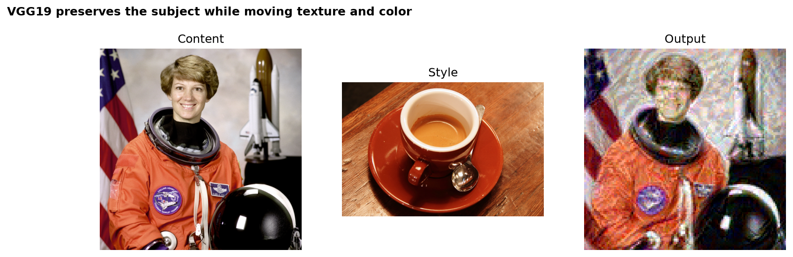
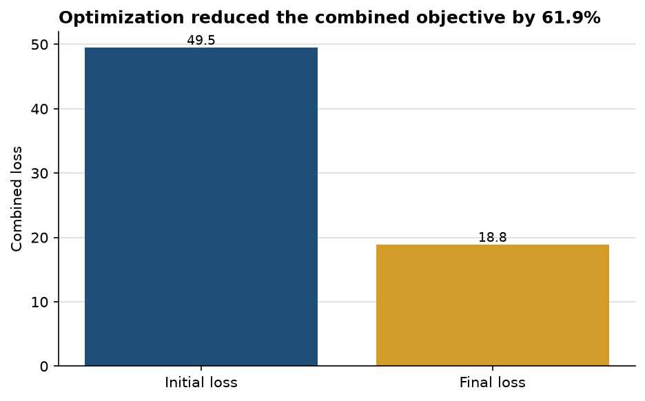

# Twelve optimization steps establish a clear style shift while retaining the subject

**Author:** Edward Ocran  
**Model:** pretrained VGG19 feature extractor  
**Inputs:** astronaut content image and coffee style image from scikit-image

## Executive summary

- The combined content-and-style objective fell from **49.46 to 18.84** in 12 steps, a **61.9% reduction**.
- The output retains the astronaut's pose and large shapes while adopting the coffee image's warmer palette and mottled texture.
- The short optimization is enough to demonstrate the mechanism, though a longer run and explicit content/style weighting would be needed for presentation-grade tuning.

## Visual assessment

The generated image preserves recognizable structure: face placement, orange suit, helmet, and dark background elements remain aligned with the content image. Texture and color change more strongly than geometry, which is the desired behavior for neural style transfer.

The output is not simply a color filter. VGG19 feature maps constrain higher-level content while Gram matrices match correlations in the style activations. That separation explains why the subject survives even as local patterns shift.

## Analytical interpretation

The steep loss reduction confirms that the optimizer is moving toward the selected feature targets. It does not, by itself, prove that every perceptual choice is better; the evidence image is therefore as important as the loss chart. At 12 steps, some regions remain rough and the style influence is uneven. Increasing the step count, saving the full loss trajectory, and comparing several style weights would show where visual gains begin to plateau.

## Reproducibility

Run `python main.py`. The stylized image is written to `outputs/stylized_output.png`. The first run downloads the official VGG19 checkpoint.
