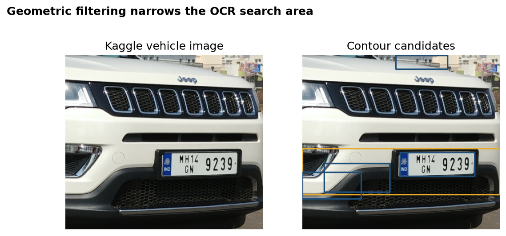
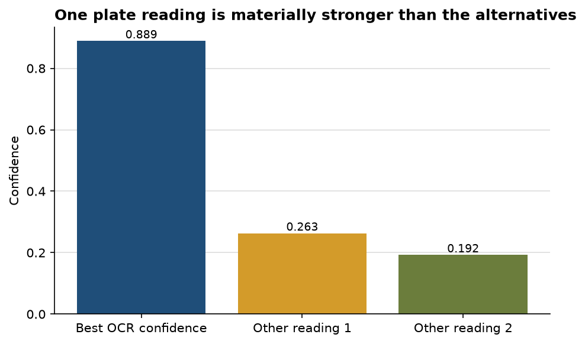

# Contour filtering isolates plausible plates, and one OCR reading clearly leads

**Author:** Edward Ocran  
**Data:** Kaggle Car Plate Detection, `Cars379.png`  
**Method:** Canny edges, contour geometry, and EasyOCR

## Executive summary

- Geometric filtering produced **six** plate-shaped candidates from a real vehicle image.
- EasyOCR's strongest reading was **“9239” at 88.88% confidence**; the other retained readings were 26.29% and 19.24%.
- The confidence separation is useful for ranking, but the dataset provides bounding boxes rather than plate transcripts, so character accuracy is not claimed.

## Detection findings

The contour stage materially reduces the search space. Instead of asking OCR to interpret the full scene, it passes rectangular regions with plate-like aspect ratios and minimum dimensions. The marked image also shows why geometry alone is insufficient: body panels, trim, and other high-contrast rectangles can survive the filter.

## OCR findings

One reading is substantially stronger than the alternatives. A practical pipeline can use that gap to prioritize review, but confidence should not be converted directly into accuracy. EasyOCR confidence is model certainty for the crop; it does not verify the plate string against a label.

The next professional improvement would score candidate boxes against the supplied XML annotations, then evaluate transcription on a separately labeled plate-text set. That separates two questions that are currently combined: whether the system found the plate and whether it read the characters correctly.

## Reproducibility and source

Run `python download_data.py` to resolve the Kaggle dataset, then `python main.py`. Dataset: [Car Plate Detection](https://www.kaggle.com/datasets/andrewmvd/car-plate-detection).
