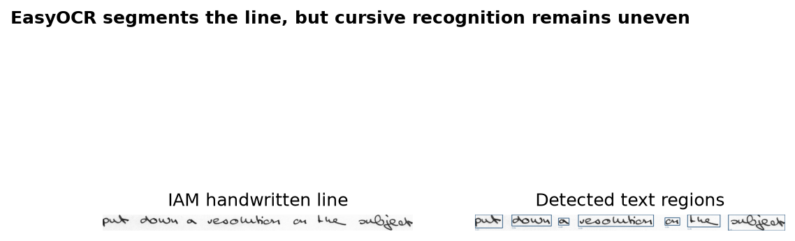
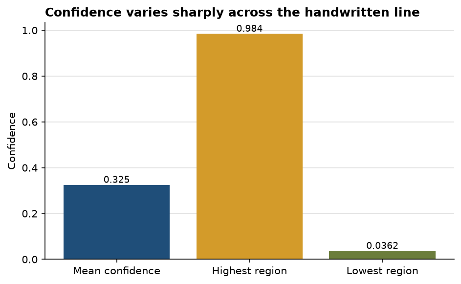

# EasyOCR finds the handwritten regions, but the transcription is not yet dependable

**Author:** Edward Ocran  
**Data:** IAM Handwriting Database through the `anris05/IAM-line` mirror  
**Reference text:** “put down a resolution on the subject”

## Executive summary

- EasyOCR split the handwritten line into **seven** text regions.
- Mean recognition confidence was **32.45%**, ranging from **3.62% to 98.42%**.
- Against the reference transcription, the output produced a **52.78% character error rate** and **100% word error rate**. The baseline therefore demonstrates extraction mechanics, not production-quality handwriting recognition.

## What worked

The detector consistently follows the handwritten baseline and separates several word-level regions. That is meaningful: the input is genuine unconstrained handwriting, not a rendered script font, and the system locates the visual text without manual coordinates.

## Where recognition breaks down

The transcript—“Puk dusl 0 vejoluhon ON Llr _ >uQeak”—captures fragments of the character shapes but not a usable sentence. Confidence is also uneven. The 98.42% region corresponds to an incorrect single-character reading, a useful reminder that local confidence can be high even when the line-level interpretation is wrong.

The most defensible next step is to replace the generic EasyOCR recognizer with a handwriting-specific sequence model trained on IAM lines, while keeping detection and transcription metrics separate. Character error rate should remain the primary diagnostic; word error rate is severe here because every reference word is affected.

## Reproducibility and source

Run `python download_data.py` to inspect the reference line, then `python main.py`. Source mirror: [IAM-line](https://huggingface.co/datasets/anris05/IAM-line).
