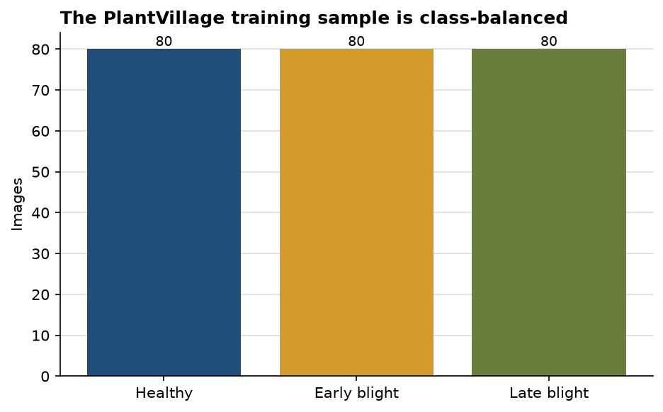
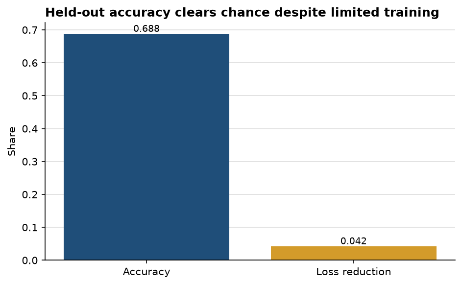

# A compact CNN separates tomato leaf conditions well above chance

**Author:** Edward Ocran  
**Data:** PlantVillage  
**Classes:** healthy, early blight, late blight

## Executive summary

- The run used **240 real leaf images**, balanced at 80 per class.
- The stratified 20% holdout contains 48 images; accuracy reached **68.75%**, versus a 33.33% three-class chance level.
- Training loss fell from **1.0993 to 1.0531** over eight epochs. The model has learned useful separation, but the small loss movement indicates that further optimization and augmentation are warranted.

## What the metrics say

Balanced sampling makes the headline accuracy easy to interpret: no class receives extra weight simply because it has more examples. At 68.75%, the two-layer CNN is doing more than memorizing the dominant label and is comfortably above chance on unseen images.

The modest 4.20% loss reduction is the more cautionary signal. Accuracy can improve quickly when obvious texture or color cues separate many images, while cross-entropy remains sensitive to uncertain probabilities and hard cases. A confusion matrix is the next essential diagnostic because early and late blight may be absorbing most of the residual error even when healthy leaves are separated cleanly.

## Recommended extension

Keep the balanced split, add rotations and lighting augmentation, and compare the current network with a small pretrained backbone. Report per-class precision and recall alongside overall accuracy. Those additions would show whether the model is clinically useful across conditions rather than merely strong on average.

## Reproducibility and source

Run `python download_data.py`, then `python main.py`. Dataset: [PlantVillage](https://www.kaggle.com/datasets/emmarex/plantdisease).
