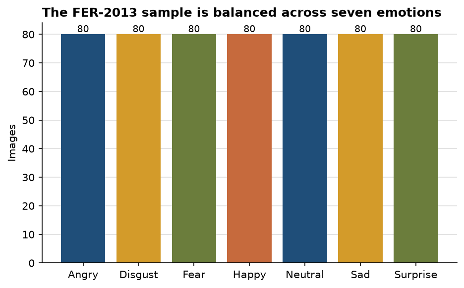
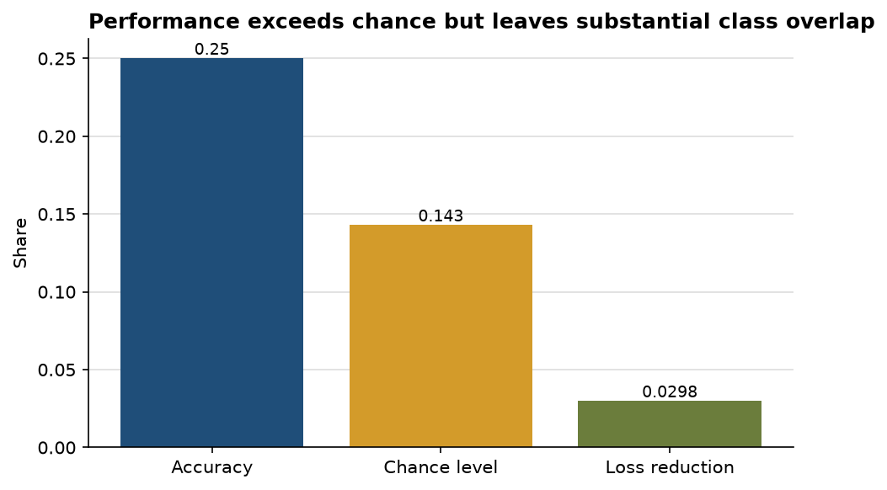

# Emotion recognition clears chance, but class overlap remains the central problem

**Author:** Edward Ocran  
**Data:** FER-2013  
**Classes:** angry, disgust, fear, happy, neutral, sad, surprise

## Executive summary

- The run uses **560 real face images**, balanced at 80 per emotion.
- On a stratified 112-image holdout, the compact CNN reaches **25.0% accuracy**, above the **14.29%** seven-class chance level.
- Loss falls from **1.9503 to 1.8922** in eight epochs, a **2.98% reduction**. The model is learning signal, but not enough for dependable individual-level emotion claims.

## Interpretation

Class balance prevents “happy” or “neutral” from dominating the score and makes the chance comparison meaningful. The 10.71-point lift over chance shows that facial structure and expression carry detectable signal even with a small two-layer architecture.

The remaining error is substantial. FER-2013 expressions can be visually ambiguous, and labels such as fear, surprise, sad, and neutral overlap in low-resolution grayscale images. Overall accuracy alone cannot reveal which pairs are being confused. A confusion matrix and per-class recall are necessary before choosing a deployment threshold or presenting the system as an emotion assessor.

## Recommended extension

The next iteration should add face alignment, augmentation, and a pretrained vision backbone, then evaluate macro F1 so every emotion contributes equally. Any practical use should frame predictions as image-expression categories, not a definitive reading of a person's internal state.

## Reproducibility and source

Run `python download_data.py`, then `python main.py`. Dataset: [FER-2013](https://www.kaggle.com/datasets/msambare/fer2013).
