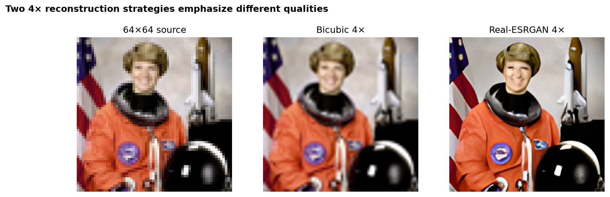
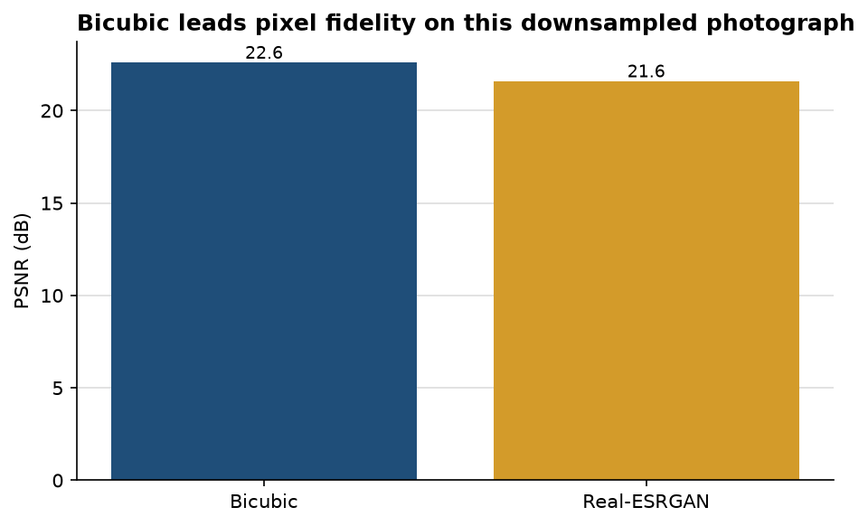

# Real-ESRGAN restores sharper texture, while bicubic remains closer pixel by pixel

**Author:** Edward Ocran  
**Model:** Real-ESRGAN x4plus  
**Reference input:** 256 × 256 astronaut image reduced to 64 × 64

## Executive summary

- Both methods reconstruct a **256 × 256** image from the same 64 × 64 input, meeting the required 4× scale.
- Bicubic interpolation scores **22.588 dB PSNR**; Real-ESRGAN scores **21.582 dB**, a 1.006 dB gap in favor of bicubic pixel fidelity.
- The visual comparison shows the tradeoff: Real-ESRGAN produces crisper edges and texture, while bicubic is smoother and numerically closer to the reference.

## Why the metrics and the image differ

PSNR rewards exact pixel reconstruction. Bicubic interpolation tends to average smoothly, which can minimize squared error after a controlled downsample. A GAN-based model is trained to produce plausible high-frequency detail; those details can look sharper while differing from the exact reference pixels.

The lower Real-ESRGAN PSNR is therefore not a failed run. It is evidence that “best” depends on the use case. Archival restoration or measurement should favor fidelity metrics and conservative reconstruction. Presentation imagery may benefit from the perceptual sharpness visible in the Real-ESRGAN output.

## Recommended extension

Add SSIM and a perceptual metric such as LPIPS, then repeat the comparison across photographs, text, and line art. A single portrait is enough to validate the pipeline, but not to rank reconstruction methods for every image type.

## Reproducibility

Run `python main.py`. The official Real-ESRGAN x4plus weights download on the first run, and the result is saved to `outputs/super_resolved.png`.
