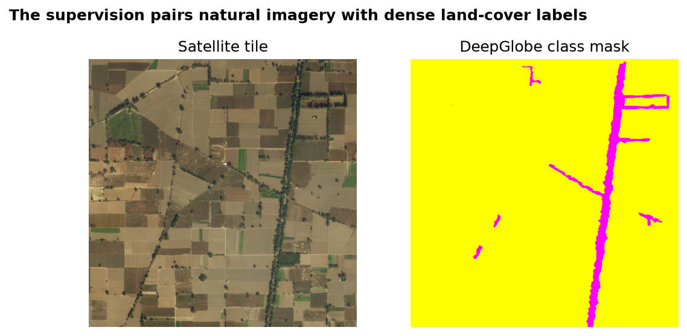
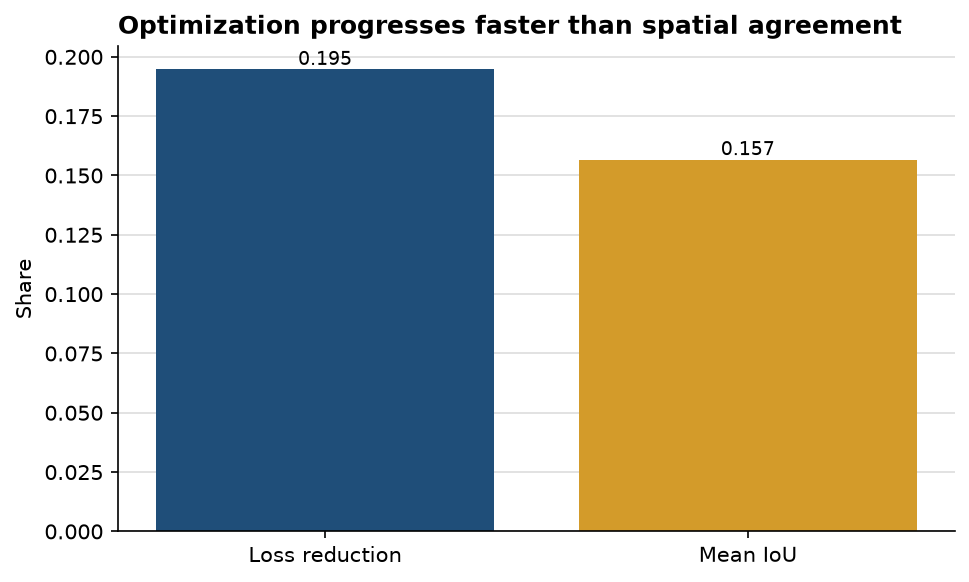

# The segmentation model learns the dominant land-cover structure before the smaller classes

**Author:** Edward Ocran  
**Data:** DeepGlobe Land Cover  
**Model:** compact UNet-style encoder-decoder

## Executive summary

- The validation run trains on **six real satellite-and-mask pairs** resized to 64 × 64 across seven encoded classes.
- Cross-entropy falls from **2.0903 to 1.6833**, a **19.47% reduction** over eight epochs.
- Mean intersection-over-union reaches **0.1567** on the training sample. Optimization is moving in the right direction, but spatial agreement remains limited and should not be read as out-of-sample performance.

## What the paired data reveals

The sample mask is dominated by one land-cover class with thin transport features cutting through it. This is a harder learning problem than image-level classification: every pixel must be assigned, narrow structures must remain connected, and rare classes can be overwhelmed by common background pixels.

The loss reduction is stronger than the IoU score because the model can improve probability estimates on dominant regions before it traces boundaries and rare classes accurately. That gap is useful. It points to class weighting, larger training crops, and boundary-aware evaluation rather than simply adding more epochs to the same six images.

## Recommended extension

Create explicit train and validation partitions, sample substantially more tiles, and report IoU by class. Weighted cross-entropy or Dice loss should be compared with the current objective, particularly for thin road and urban features. The existing result validates data loading, palette encoding, and an end-to-end segmentation pass; it is not a final land-cover benchmark.

## Reproducibility and source

Run `python download_data.py`, then `python main.py`. Dataset: [DeepGlobe Land Cover Classification](https://www.kaggle.com/datasets/balraj98/deepglobe-land-cover-classification-dataset).
