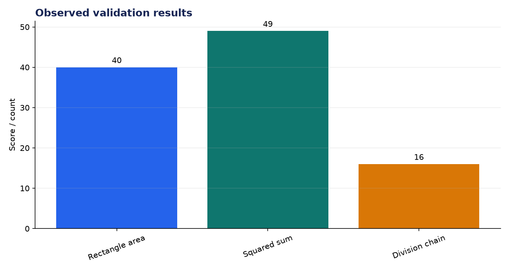
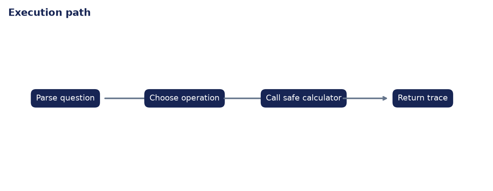

# Technical Evaluation: Math Reasoning Agent (ReAct Pattern)

**Author:** Edward Ocran  
**Project:** 51  
**Validation status:** Passed

## Executive finding

The agent solved all three word problems correctly and made exactly one calculator call per problem. The trace is deliberately short: identify the operation, call the restricted calculator, and report the observation.



## What the run shows

The strongest result is not the arithmetic difficulty; it is the inspectability of the route to the answer. Each response exposes the expression sent to the tool, while the AST-based calculator rejects names, imports, and arbitrary Python. That gives the agent a smaller attack surface than an `eval`-based implementation.



## Method

The project was run through its normal workflow and its returned metrics were checked against the included automated test. The chart above reports the observed demonstration values; it is not a benchmark against unrelated systems. The second figure documents the control flow so the result can be reproduced and audited from the code.

## Interpretation and next decision

The current parser covers the three demonstrated language patterns. A production version should add a formal expression planner and a larger adversarial test set before handling unconstrained questions.

## Reproduce the analysis

```powershell
python main.py
python -m unittest -v test_project.py
```

The implementation and test output are the primary evidence. External source details, where used, are documented in `INPUTS.md`.
