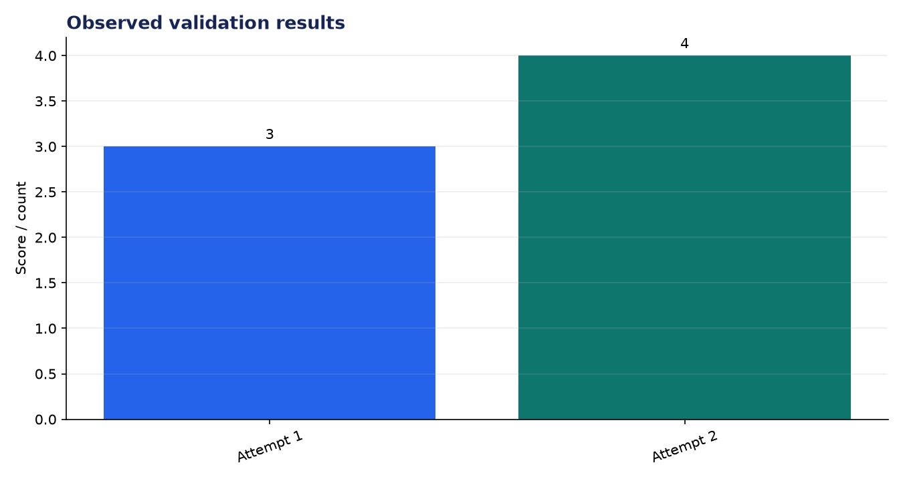
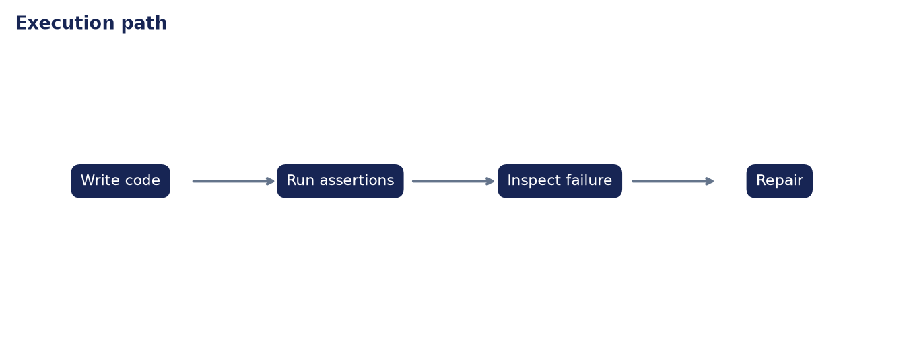

# Analysis Report: Coding Bot with Tool Use

**Author:** Edward Ocran  
**Project:** 52  
**Validation status:** Passed

## Executive finding

The coding bot generated an `is_prime` function, executed four assertions, identified the boundary error for values below two, and repaired the function on its second attempt. The final program passed four of four tests.



## What the run shows

The failed first attempt is the useful observation. Three passing tests could have created false confidence, but the explicit `is_prime(1)` assertion exposed the defect. The repair changed one branch rather than rewriting the solution, which keeps the correction attributable and easy to review.



## Method

The project was run through its normal workflow and its returned metrics were checked against the included automated test. The chart above reports the observed demonstration values; it is not a benchmark against unrelated systems. The second figure documents the control flow so the result can be reproduced and audited from the code.

## Interpretation and next decision

Execution is intentionally restricted to a small builtin allow-list. This is suitable for a demonstration, not a security boundary for hostile code; production execution belongs in an isolated process or container with time and memory limits.

## Reproduce the analysis

```powershell
python main.py
python -m unittest -v test_project.py
```

The implementation and test output are the primary evidence. External source details, where used, are documented in `DATASET.md`.
