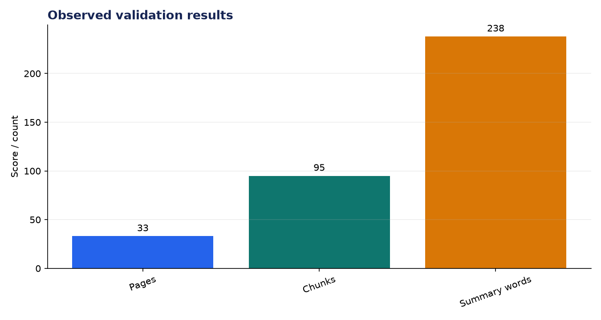
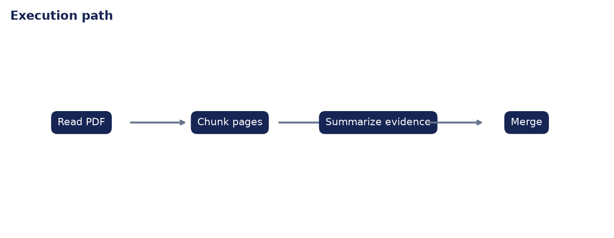

# Technical Evaluation: PDF Summarizer with Agents

**Author:** Edward Ocran  
**Project:** 53  
**Validation status:** Passed

## Executive finding

The pipeline processed the public ReAct paper: 33 pages, 110,255 extracted characters, 95 working chunks, and a 238-word document summary. Chunk summaries remain available for audit, while the final synthesis emphasizes the abstract and stated contribution.



## What the run shows

A full-document frequency score over-weighted repeated experiment text and appendix traces. Anchoring the final synthesis in the opening material produced a more faithful account of the paper's research question and contribution. The separation between chunk evidence and final narrative is important: it lets a reviewer inspect what was compressed.



## Method

The project was run through its normal workflow and its returned metrics were checked against the included automated test. The chart above reports the observed demonstration values; it is not a benchmark against unrelated systems. The second figure documents the control flow so the result can be reproduced and audited from the code.

## Interpretation and next decision

The method is extractive and does not resolve figures or multi-column reading order perfectly. Page-level provenance and layout-aware extraction would be the next improvements for technical documents.

## Reproduce the analysis

```powershell
python main.py
python -m unittest -v test_project.py
```

The implementation and test output are the primary evidence. External source details, where used, are documented in `INPUTS.md`.
