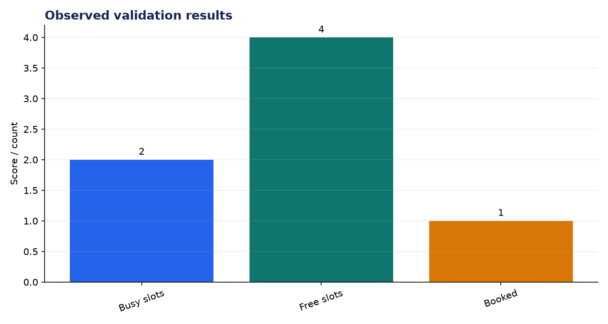
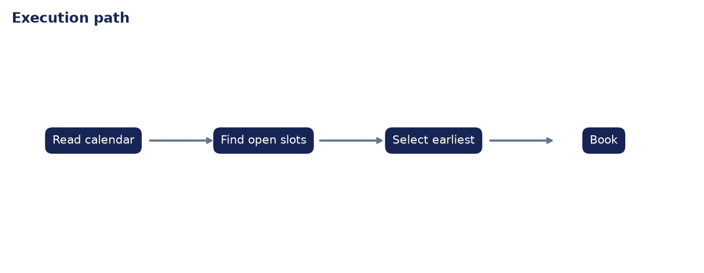

# Technical Evaluation: AI Calendar Scheduler Agent

**Author:** Edward Ocran  
**Project:** 54  
**Validation status:** Passed

## Executive finding

The scheduler inspected the afternoon business-hour window, found four available slots around two occupied periods, and booked the earliest valid time at 12:00 on 5 October 2026. The calendar increased from three to four events without overwriting an existing entry.



## What the run shows

Selecting from a computed availability set makes the decision reproducible. The result also shows why a scheduler should return alternatives: the chosen noon slot is efficient, but three later times remain available if a participant rejects it.



## Method

The project was run through its normal workflow and its returned metrics were checked against the included automated test. The chart above reports the observed demonstration values; it is not a benchmark against unrelated systems. The second figure documents the control flow so the result can be reproduced and audited from the code.

## Interpretation and next decision

This implementation uses a local calendar dictionary and hourly slots. Real deployment needs time-zone normalization, participant calendars, duration-aware overlap checks, and explicit confirmation before writing to an external calendar.

## Reproduce the analysis

```powershell
python main.py
python -m unittest -v test_project.py
```

The implementation and test output are the primary evidence. External source details, where used, are documented in `INPUTS.md`.
