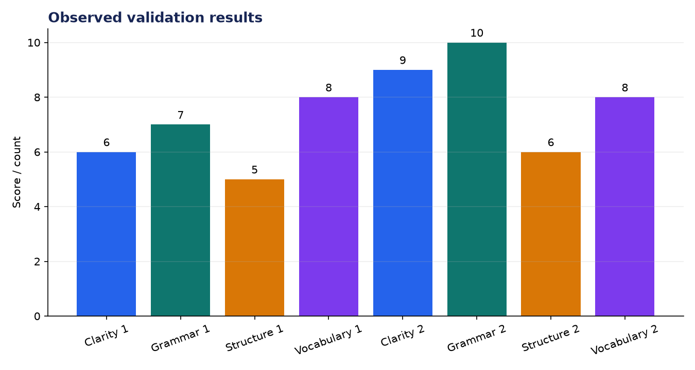
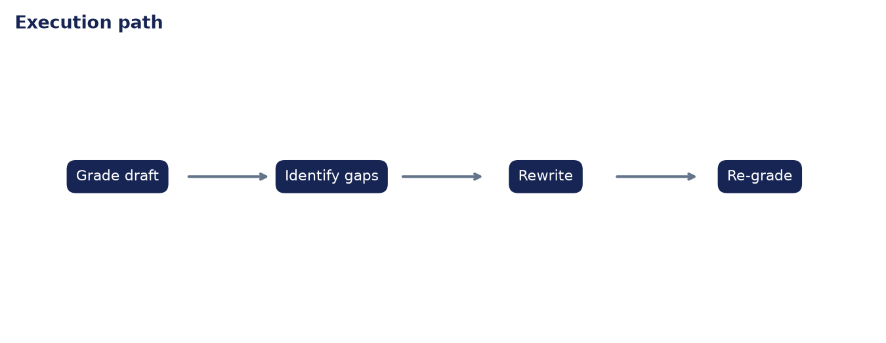

# Analysis Report: Self-Correcting Essay Grader

**Author:** Edward Ocran  
**Project:** 55  
**Validation status:** Passed

## Executive finding

The first draft scored 6.50/10. After targeted expansion, the second draft reached 8.25/10: a 1.75-point improvement. The rewrite grew from 13 to 50 words and strengthened clarity, grammar, and structure while vocabulary remained stable.



## What the run shows

The score pattern is more informative than the headline uplift. Grammar reached the ceiling and clarity improved sharply, but structure rose only one point and vocabulary did not move. A further revision should therefore add a clearer paragraph progression and more precise subject vocabulary rather than simply adding length.



## Method

The project was run through its normal workflow and its returned metrics were checked against the included automated test. The chart above reports the observed demonstration values; it is not a benchmark against unrelated systems. The second figure documents the control flow so the result can be reproduced and audited from the code.

## Interpretation and next decision

The rubric is deterministic and surface-feature based. It is useful for demonstrating a grade–critique–rewrite–regrade loop, but it should not be presented as a substitute for trained human assessment.

## Reproduce the analysis

```powershell
python main.py
python -m unittest -v test_project.py
```

The implementation and test output are the primary evidence. External source details, where used, are documented in `DATASET.md`.
